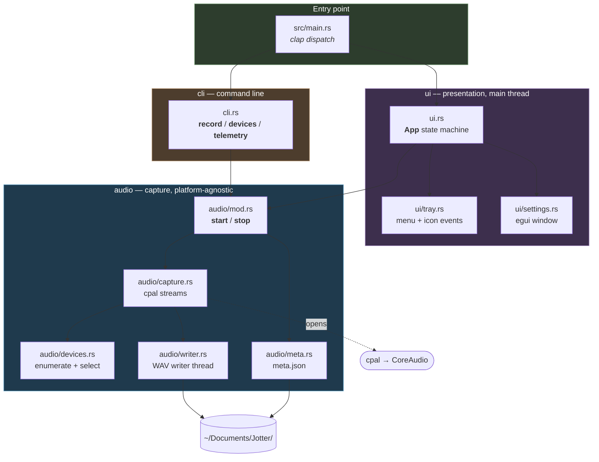
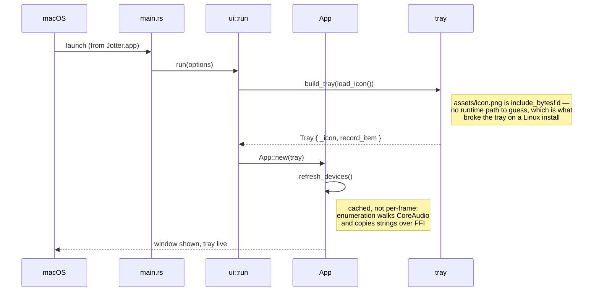
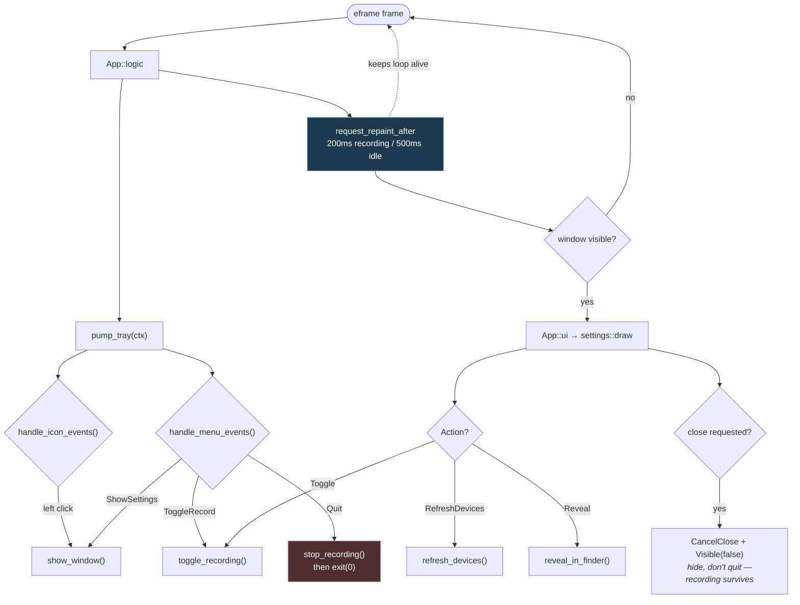
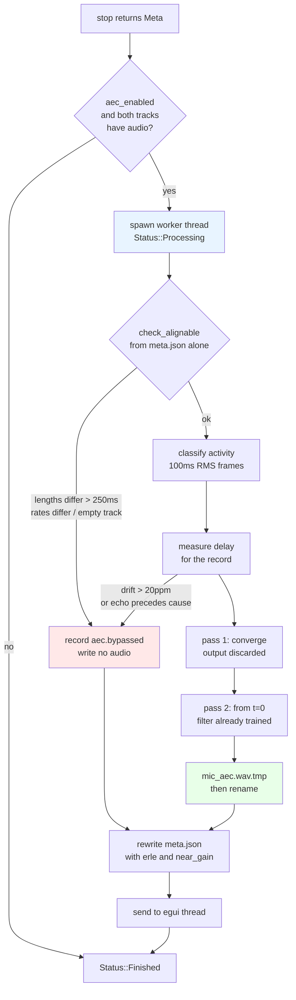
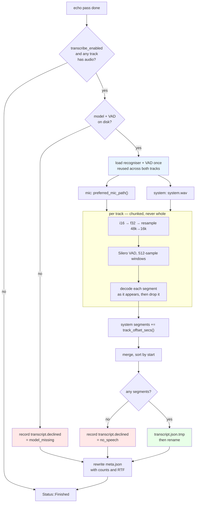

# Jotter architecture

How the app is put together and how audio data moves through it.

For the macOS permission story, the cpal loopback mechanics and the debug
scripts, see [AUDIO_CAPTURE.md](AUDIO_CAPTURE.md). For exactly what the app
reports and how to turn it off, see [TELEMETRY.md](TELEMETRY.md).

---

## The shape of it

Everything lives in the library crate. `src/main.rs` is a thin entry point that
parses arguments with clap and dispatches: no subcommand opens the tray app,
`record` and `devices` run the CLI. Both front ends drive the same `audio` API —
so anything the CLI proves about capture also holds for the app.



The one rule worth preserving: **`audio` knows nothing about `ui` or `cli`.**
Dependencies point one way, which is why the CLI can exercise the whole capture
path without starting a GUI.

The two front ends are cargo features, both on by default:

| Build | Command | Contains |
| --- | --- | --- |
| Default | `cargo build` | tray app + CLI |
| CLI only | `cargo build --no-default-features --features cli` | CLI; no eframe/egui/tray-icon |
| GUI only | `cargo build --no-default-features --features gui` | tray app; no clap |

Each offline pass is a feature too, and for the same reason: `aec` builds
WebRTC's AudioProcessing from C++ source, and `transcribe` links sherpa-onnx and
an ONNX runtime. Turning either off removes that whole stack from the build
rather than merely skipping a call.

`transcribe` links **statically** — the sherpa-onnx crate's default — so the
shipped artifact is still one binary with no shared library for a user to be
missing. The cost is that the *build* downloads a prebuilt archive for the host
target from GitHub releases. `SHERPA_ONNX_LIB_DIR` (a directory of libraries) or
`SHERPA_ONNX_ARCHIVE_DIR` (a pre-downloaded archive) are the levers if that ever
has to happen offline.

`audio` is unconditional, so it must never depend on clap or eframe — that is why
`cli.rs` mirrors `audio::Sources` in its own `ValueEnum` shim instead of deriving
on the real type.

---

## Workflow 1 — Startup



---

## Workflow 2 — The event loop

eframe 0.36 splits the loop in two, and the split matters here: **while the
window is hidden, eframe runs no egui pass at all** and calls `logic` instead of
`ui`. Since the window spends most of its life hidden, tray polling has to live
in `logic` — in `ui` the menu would be dead exactly when it is the user's only
interface.

`logic` only runs when a repaint is pending, so it re-arms itself.



---

## Workflow 3 — Starting a recording

Both entry points converge on `audio::start`. The mic and system paths are
deliberately **separate functions** rather than one parameterised helper: they
differ in which config accessor applies and in which failures matter, and
collapsing them is what makes the loopback footgun easy to trip.

```mermaid
sequenceDiagram
    autonumber
    participant U as User
    participant App as ui::App
    participant S as audio::start
    participant C as capture
    participant D as devices
    participant W as TrackWriter
    participant CP as cpal

    U->>App: Start Recording
    App->>App: dir = recordings_root()/<br/>recording_dir_name()
    App->>S: start(RecordConfig)
    S->>S: create_dir_all(out_dir)
    Note right of S: first run prompts for<br/>Documents access (TCC)

    rect rgb(31, 58, 77)
    Note over S,CP: Microphone
    S->>C: open_mic(choice, mic.wav)
    C->>D: resolve_mic()
    Note right of D: prefers BuiltIn over system default —<br/>macOS degrades Bluetooth mics<br/>into call mode
    C->>CP: default_input_config()
    C->>W: TrackWriter::new() → (writer, sink)
    C->>CP: build_input_stream(sink)
    end

    rect rgb(61, 47, 77)
    Note over S,CP: System audio
    S->>C: open_loopback(choice, system.wav)
    C->>D: resolve_system()
    C->>C: supports_input()?
    Note right of C: DUPLEX GUARD — cpal only taps<br/>a device reporting NO input.<br/>Otherwise it records the mic,<br/>silently, into system.wav
    C->>CP: default_output_config()
    Note right of C: not default_input_config():<br/>the device has no input config
    C->>W: TrackWriter::new() → (writer, sink)
    C->>CP: build_input_stream(sink)
    Note right of CP: no explicit loopback API —<br/>input stream on an OUTPUT device.<br/>macOS: CoreAudio process tap<br/>Windows: WASAPI loopback flag<br/>Linux: PipeWire STREAM_CAPTURE_SINK
    end

    S->>CP: stream.play() ×2
    Note right of CP: cpal 0.17 stopped auto-starting.<br/>0.18 is play()/pause(), not start()
    S-->>App: RecordingHandle
    App->>App: status = Recording<br/>tray.set_recording(true)
```



---

## Workflow 4 — The audio hot path

This is the part with real constraints. The cpal callback runs on a **realtime
audio thread**; blocking it on file I/O causes dropouts. So the callback does
only cheap, bounded work and hands ownership across a channel.

```mermaid
flowchart LR
    subgraph rt["Realtime audio thread — never blocks"]
        CB["cpal data callback<br/>samples + InputCallbackInfo"]
        TS["TrackSink::push"]
        T1["record first callback<br/>StreamInstant (once)"]
        T2["downmix to mono<br/><i>average channels</i>"]
        T3["f32 → i16<br/><i>clamp before scaling</i>"]
        CB --> TS --> T1 --> T2 --> T3
    end

    CH{{"mpsc::channel<br/>Vec&lt;i16&gt;"}}
    T3 -->|send, owned buffer| CH

    subgraph wt["Writer thread — may block"]
        RX["for buf in rx"]
        HW["hound::WavWriter<br/>write_sample"]
        FIN["finalize()<br/><i>on channel close</i>"]
        RX --> HW --> FIN
    end

    CH --> RX
    FIN --> WAV[("mic.wav / system.wav")]

    style rt fill:#4d2f2f,stroke:#b87f7f,color:#fff
    style wt fill:#1f3a4d,stroke:#4a90b8,color:#fff
```



Why each step is the way it is:

| Step | Reason |
| --- | --- |
| Channel, not direct write | A realtime thread that blocks on I/O produces dropouts. |
| Clamp before scaling | Loopback audio can exceed ±1.0 when an app applies its own gain; wrapping would turn a loud passage into harsh noise. |
| Downmix to mono | System audio arrives stereo, the mic mono. Transcription wants one channel. |
| **No resampling** | Native 48 kHz is preserved. Whisper wants 16 kHz, but decimating in the callback would alias — resample later with a real resampler. |
| Dropped buffer on send failure | If the writer dies or falls behind, dropping is the only realtime-safe option. The frame count in `meta.json` reflects the loss. |
| First `StreamInstant` recorded once | The two streams have independent clocks; on macOS both instants derive from host time, so their difference aligns the tracks. |

---

## Workflow 5 — Stopping

Ordering matters. Pause before tearing down writers so no callback races the
channel close, and finalize before the process exits.

```mermaid
sequenceDiagram
    autonumber
    participant U as User
    participant App as ui::App
    participant H as RecordingHandle::stop
    participant W as TrackWriter::finish
    participant WT as writer thread
    participant M as meta

    U->>App: Stop / Quit / Cmd-Q
    App->>H: handle.stop()
    H->>H: stream.pause(); drop(stream)
    Note right of H: pause first — a live callback<br/>racing the channel close
    H->>W: finish() per track
    W->>W: drop Sender
    Note right of W: closing the channel is what<br/>ends the writer's `for buf in rx`
    WT->>WT: finalize() → real RIFF length
    Note right of WT: skip this and the header keeps<br/>a placeholder length; many tools<br/>then refuse to open the file
    WT-->>W: frames written
    W-->>H: TrackInfo
    H->>M: Meta { started, ended, mic, system }
    M->>M: write(meta.json)
    H-->>App: Meta
    App->>App: status = Finished
```

**Every exit path finalizes.** Tray Quit calls `stop_recording` before
`exit(0)`; `App::on_exit` catches Cmd-Q and normal shutdown. Without both, a
crash-out mid-meeting leaves an unreadable WAV and you find out at transcription
time.

---

## Workflow 6 — Removing the echo

Runs after the recording is already saved, so nothing here can lose audio. The
mic track is never modified; the result is a second file beside it.



### Why each step is the way it is

| Step | Reason |
| --- | --- |
| Offline, not in the callback | The two cpal streams never see each other, and the realtime callback must not allocate. Offline also means recordings made before this existed can be cleaned. |
| On a worker thread | `stop()` is called from the egui thread. A pass takes tens of seconds on a long meeting, and blocking there freezes the window *and* the tray. |
| Drained in `logic`, not `ui` | A tray app spends most of its life with the window hidden. A result that only landed when someone opened the window would leave the pane stale. |
| `check_alignable` first | Every check in it is answerable from `meta.json`, so a hopeless recording costs no I/O at all. |
| Tracks fed unaligned | AEC3 estimates the delay itself. Pre-shifting by our own measurement risks an alignment slightly *too large*, which asks the filter to model an echo arriving before its cause — inexpressible, and unrecoverable. |
| Two passes | The first second or two of a cold filter is uncancelled, and in a meeting that is the greeting. Worth 5 dB on echo-only passages. |
| tmp + rename | The tray's Quit calls `process::exit(0)`. A pass killed mid-write would otherwise leave a truncated file whose RIFF header claims it is complete. |
| Bypass reasons in `meta.json` | A pass must be able to say "I decided not to, and here is why". No file and no explanation is indistinguishable from a crash. |
| The mechanics in `audio/stage.rs`, ungated | Everything above except the cancelling itself is what *any* pass does — read the directory, write one artifact, record the outcome — and transcription is next. Each pass sits behind its own cargo feature, so the shared part is behind none of them: a transcriber must not have to build the WebRTC C++ stack to reuse a rename. |

---

## Workflow 7 — Transcribing it

Runs after echo cancellation, never before: the transcriber reads whichever mic
track `preferred_mic_path` hands back, so it has to wait for that pass to write
its verdict. Both tracks are transcribed **separately** and merged onto one
timeline — the payoff for having captured them separately in the first place.



### Why each step is the way it is

| Step | Reason |
| --- | --- |
| Both tracks, separately | The whole argument for two tracks. "Was this me or everyone else" is answered by which file the audio came out of, with no inference at all. Diarization is then only left splitting the system track into individual people. |
| After the echo pass | It reads whatever `preferred_mic_path` returns, which is not decided until that pass has recorded its numbers. Running first would transcribe audio the canceller was about to improve. |
| System timestamps shifted | The two cpal streams start at different instants, so a time from `system.wav` and one from `mic.wav` are not comparable. Skip the shift and the reply lands before the remark. |
| VAD rather than fixed windows | An hour will not go through a FastConformer encoder in one call, and a fixed window cuts mid-word. Speech-bounded segments give bounded memory, timestamps that mean something, and the segmentation diarization wants. |
| Resample once, up front | The recogniser would resample for us; the VAD would not. Two components disagreeing about what a sample index means is a bug class worth designing out. |
| Chunked conversion | An hour of 48 kHz mono as `f32` is 690 MB on top of the 346 MB the `i16` track already costs. Segments are decoded and dropped as they appear for the same reason. |
| The model is never downloaded here | Fetching is `jotter models pull`, a deliberate act. A missing model is a decline with the command in the message. With telemetry off this binary still opens no socket unless asked. |
| Half the cores, capped at 4 | This runs on the user's laptop right after a meeting, very likely while they are doing something else. Past four the encoder stops scaling anyway. |
| `speaker` in the format from v1 | Diarization fills it in rather than changing a file shape other things have started reading. Omitted from the JSON while unset, so an undiarized transcript carries no misleading nulls. |

---

## Recording state machine

```mermaid
stateDiagram-v2
    [*] --> Idle
    Idle --> Recording: toggle_recording()<br/>audio::start ok
    Idle --> Error: start failed<br/>(duplex / permission / io)
    Recording --> Processing: stop() ok<br/>and a pass is enabled
    Recording --> Finished: stop() ok
    Recording --> Error: stop() failed
    Processing --> Processing: echo pass done,<br/>transcription starts
    Processing --> Finished: last pass done<br/>(applied or declined)
    Processing --> Error: pass failed
    Error --> Recording: retry
    Finished --> Recording: start again

    note right of Recording
        Device pickers are locked.
        A device cannot change
        underneath a live stream.
    end note

    note right of Processing
        The audio is already on disk.
        Nothing is at risk if the app
        is quit here.
    end note

    note right of Finished
        A zero-frame track is flagged
        red — otherwise it is
        indistinguishable from success.
    end note
```

---

## Output

```
~/Documents/Jotter/2026-09-15_14-32-08/
├── mic.wav         you           48 kHz mono i16
├── mic_aec.wav     you, echo removed — only when the pass ran and did not decline
├── system.wav      everyone else  48 kHz mono i16
├── transcript.json both tracks, on one timeline — only when transcription ran
└── meta.json       devices, rates, frames, stream_errors, first-callback instants,
                    and what each offline pass did or why it declined
```

Models are **not** in here. They are shared across every recording and live in
the app data directory (`jotter models path`), fetched once by `jotter models
pull`.

`transcript.json`:

```json
{
  "version": 1,
  "model": "parakeet-tdt-0.6b-v2-int8",
  "segments": [
    { "start": 0.42, "end": 3.10, "track": "mic",    "text": "morning all" },
    { "start": 3.20, "end": 8.04, "track": "system", "text": "morning, shall we start" }
  ]
}
```

`track` is the cheap half of speaker attribution and costs nothing: the
operating system already separated the two signals. Segments also carry an
optional `speaker`, omitted while unset, which a diarization pass will fill in
for the `system` track without changing the shape of the file.

Times are on the **mic track's** timeline. System segments have already been
shifted onto it by `meta.track_offset_secs()`, so a reader never has to know the
two streams started at different instants.

Two tracks rather than one mixed file, because merging is lossy in ways you
cannot undo: overlapping speech collapses (Whisper drops or garbles a speaker),
diarization has to recover "me" from scratch instead of knowing it for free, and
per-track gain normalization becomes impossible. You can always mix down later;
you can never un-mix.

`mic_aec.wav` is additive, never a replacement: `mic.wav` is the one artifact
that cannot be recreated. Downstream consumers should call
`Meta::preferred_mic_path(dir)` rather than picking a file themselves — it
returns the cancelled track only when the pass's own recorded numbers clear the
bar, so a pass that ran and achieved nothing does not get fed to transcription
just because it produced a file.

**Every path in `meta.json` is relative to the recording directory**, which is
why the accessors take that directory and hand back a resolved path. The folder
is the unit that gets moved, copied and archived, so anything reaching outside
it stops resolving the moment it is. `meta.json` files written before this was
settled hold an absolute path from the GUI or a cwd-relative one from the CLI;
`TrackInfo::resolve` takes the file name from those and resolves it against the
directory the file was actually found in.

Downstream, `transcript.json` is what feeds `action_items.sh` /
`action_items_chunked.sh`. Those scripts read a line-per-utterance text format,
so until a stage writes one directly:

```bash
jq -r '.segments[] | "[\(.start) - \(.end)] \(.track): \(.text)"' transcript.json
```

---

## Failure modes worth knowing

These are the ones that fail *quietly*, which is why the code checks for them
explicitly rather than trusting the happy path.

| Symptom | Cause | Where it's handled |
| --- | --- | --- |
| `system.wav` is all digital zeros | No system-audio permission. macOS runs the tap and feeds it silence rather than failing. | Flagged by `analyze_wav.py`; requires running from the bundle |
| `system.wav` contains the **microphone** | Loopback opened on a duplex device — cpal's tap branch only triggers when `supports_input()` is false | `open_loopback` refuses duplex outright (`CaptureError::DuplexSystemDevice`) |
| Zero frames captured | Output device was idle — a tap produces no callbacks when nothing is playing | Flagged in the settings pane and CLI output |
| Truncated / unopenable WAV | Process exited without `finalize()` | `on_exit` + tray Quit both stop first |
| Tray menu unresponsive | Polling put in `ui` instead of `logic` | `logic` polls and re-arms its own repaint |
| Writes to `/recordings` | Relative path from a bundle, whose cwd is `/` | `recordings_root()` is absolute |
| `mic_aec.wav` sounds *worse* than `mic.wav` | A misaligned far-end reference adds uncorrelated energy instead of removing echo. Happens when the two tracks cannot be aligned at all — an idle macOS tap, or drifting clocks | `process::check_alignable` and the drift guard bypass rather than guess; the reason lands in `meta.json` as `aec.bypassed` |
| Echo removal looks like it ate the speaker's voice | Frames were classified near-only while the echo tail was still decaying, so correctly removing it counted as damage | 200 ms far-end hangover in `process::classify` |
| The window freezes for seconds after Stop | The pass ran on the egui thread | `App::start_processing` spawns it; `poll_processing` drains in `logic` |
| Transcription never runs, or every recording records `model_missing` | The speech model was never downloaded. Transcription is the one pass that cannot work on a fresh install, which is why `transcribe_enabled` defaults off | `jotter models pull`; the settings pane says so before the box is ticked, and the decline names the command |
| The transcript reads as two interleaved monologues, replies before remarks | System timestamps used raw instead of shifted onto the mic timeline — the two cpal streams start at different instants | `transcript::Segment::shifted`, applied in `transcribe::run` from `Meta::track_offset_secs` |
| Transcription finds no speech in an obviously non-silent track | Audio fed to Silero VAD at the wrong rate. It is a 16 kHz model and our tracks are 48 kHz | Both tracks go through `LinearResampler` once before the detector *or* the recogniser sees them |
| A transcript that reads like a stutter, one fragment per breath | The voice-activity pass cutting at every short pause, which also costs the recogniser its context | `MIN_SILENCE_SECS` — half a second is a turn boundary, less is someone thinking |

---

## Module reference

| Module | Owns |
| --- | --- |
| `audio/mod.rs` | `RecordConfig`, `Sources`, `RecordingHandle`; `start` / `stop` orchestration |
| `audio/devices.rs` | Enumeration, direction classification, `can_loopback()`, default selection |
| `audio/capture.rs` | `open_mic` / `open_loopback`, the duplex guard, `CaptureError` and its per-platform access hints |
| `audio/writer.rs` | `TrackWriter` / `TrackSink`, the realtime→writer boundary, format conversion |
| `audio/meta.rs` | `Meta`, `TrackInfo`, `AecInfo`, `track_offset_secs()`, `preferred_mic_path()`, `timestamp_dir_name()`, the recording-directory path convention |
| `audio/aec/mod.rs` | The AEC3 wrapper, `AecStats`, the frame-activity threshold (feature `aec`) |
| `audio/aec/delay.rs` | Echo-delay measurement, the drift and swapped-track guards |
| `audio/stage.rs` | What every offline pass shares: the `Stage` trait and its already-processed check, `DeclineReason`, `write_atomic`, the WAV read/write helpers. Not feature-gated |
| `audio/process.rs` | The echo-cancellation stage: activity classification, bypass decisions, `meta.json` rewrite (feature `aec`) |
| `audio/transcript.rs` | The `transcript.json` format: `Transcript`, `Segment`, `Track`, and the merge onto one timeline. Not feature-gated — reading a transcript must not require the inference stack |
| `audio/transcribe.rs` | The transcription stage: VAD segmentation, the `Transcriber` seam, decline decisions, `meta.json` rewrite (feature `transcribe`) |
| `models.rs` | The speech-model catalogue, where models live on disk, and `resolve` (feature `transcribe`) |
| `models/fetch.rs` | The verified downloader behind `jotter models pull`. The only code here that opens a socket for a reason other than telemetry |
| `main.rs` | clap parsing and the GUI/CLI dispatch |
| `cli.rs` | `record` / `devices` / `telemetry` subcommands and their console output |
| `ui.rs` | `App`, the recording state machine, tray pumping, paths, `run()` |
| `ui/tray.rs` | `Tray`, `MenuAction`, event draining |
| `ui/settings.rs` | egui window, device pickers, status rendering, the privacy section |
| `config.rs` | `Settings` — the only persisted preferences, and the telemetry opt-out |
| `telemetry/mod.rs` | The `Telemetry` handle, and its no-op twin for builds without the feature |
| `telemetry/worker.rs` | The one thread that does network I/O; PostHog client lifecycle |
| `telemetry/events.rs` | Every event name, and the `Meta` → properties allowlist |
| `telemetry/scrub.rs` | Home-directory redaction for payloads Jotter does not build itself |

## Telemetry

Anonymous usage and crash reporting via PostHog, behind the default-on
`telemetry` feature. `docs/TELEMETRY.md` is the user-facing contract and lists
every event; the notes here are the ones that constrain the code.

Three properties the implementation is built to preserve:

1. **`audio` still knows nothing about anything else.** The only change there is
   `CaptureError::kind()`, a method on an existing enum. Instrumentation lives in
   the front ends.
2. **Nothing identifying can be sent by accident.** `Telemetry::track` takes
   `&'static str` property values, so a device name or a path cannot reach it
   without someone going well out of their way. `CaptureError`'s `Display` names
   the device — that is what it is for — which is exactly why `kind()` exists.
3. **Off means off.** The PostHog client is constructed lazily, on the first
   transition to enabled. Opted out, there is no client, no flag polling, and no
   socket. Jotter has no other use for the network.

Three things that are easy to get wrong here:

- **Every exit path must drain explicitly.** The tray's Quit calls
  `process::exit`, which runs no destructors, so `Drop` is not a mechanism. See
  `App::finish_session`.
- **The realtime audio callback is never instrumented.** Allocating or locking on
  that thread causes dropouts. `TrackInfo::stream_errors` is already an atomic
  counter; it is reported at `stop`.
- **`init_global` must come before any network call in `worker::start`.** It is
  what installs the panic hook, and every panic in this app is in tray
  construction, milliseconds after launch. An earlier version evaluated feature
  flags first, putting a full HTTP round trip in front of the hook; a forced
  panic at `ui/tray.rs:104` was then lost entirely, and captured once the order
  was flipped. Both states were confirmed against a live project, so this is a
  measurement rather than a theory. Flag evaluation is deliberately second.

macOS builds are ad-hoc codesigned with no App Sandbox, so outbound HTTPS needs
no entitlement and no ATS exception. Mac App Store distribution would later
require `com.apple.security.network.client`.
