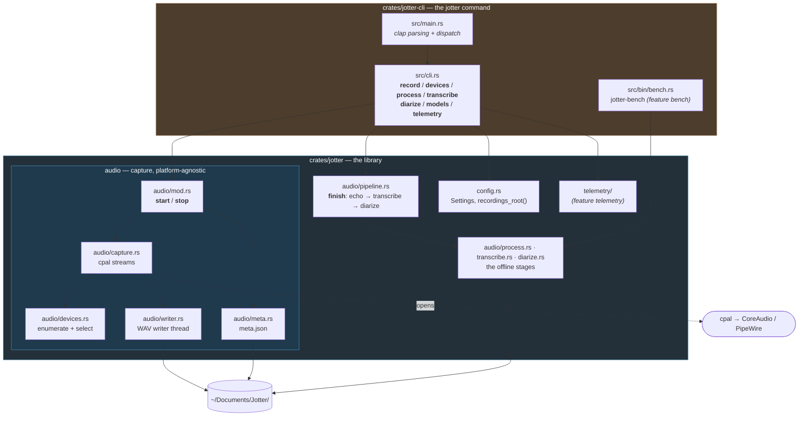
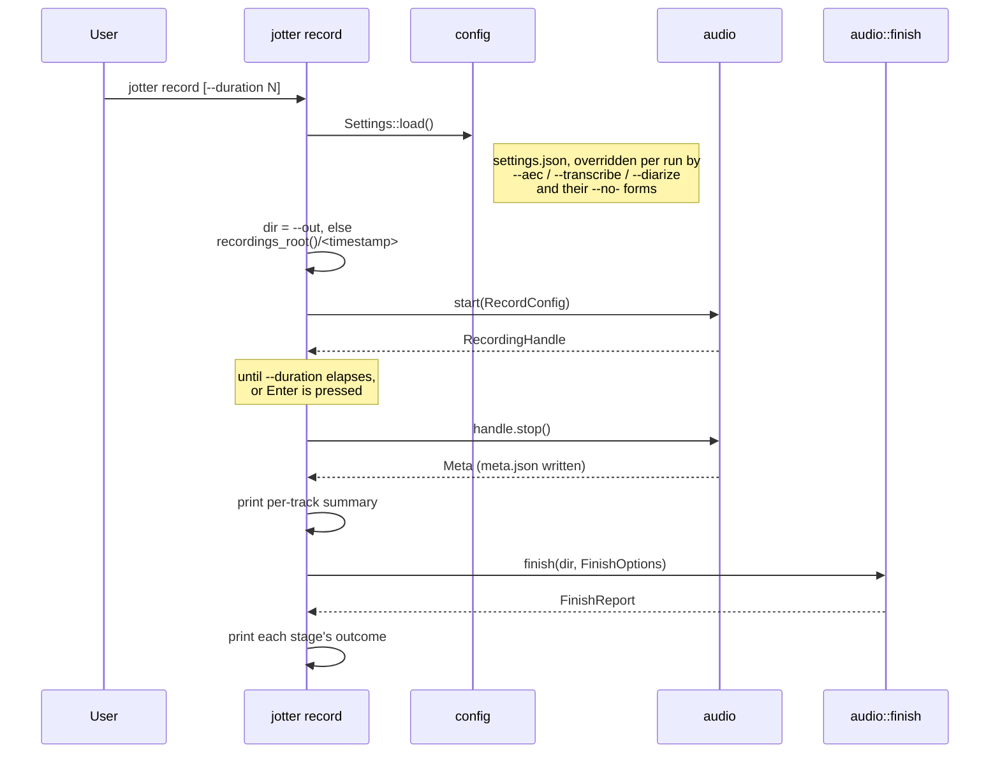
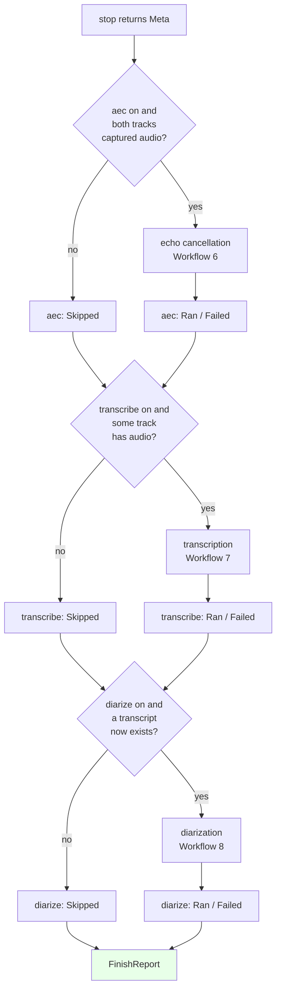
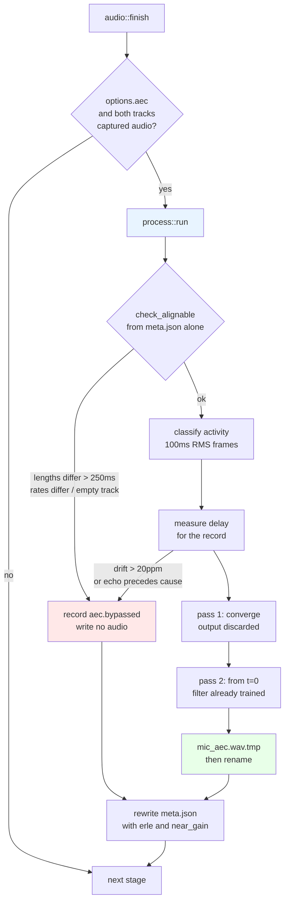
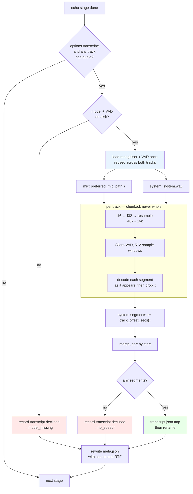
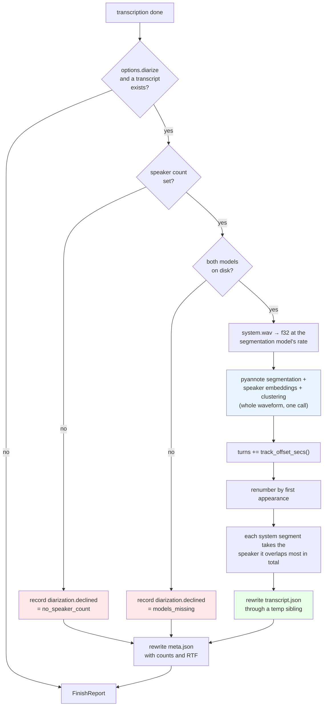

# Jotter architecture

How Jotter is put together and how audio data moves through it.

For the macOS permission story, the cpal loopback mechanics and the debug
scripts, see [AUDIO_CAPTURE.md](AUDIO_CAPTURE.md). For exactly what Jotter
reports and how to turn it off, see [TELEMETRY.md](TELEMETRY.md).

---

## The shape of it

Jotter is a Cargo workspace of two crates. `crates/jotter` is a library that
holds everything that records and processes audio. `crates/jotter-cli` is the
`jotter` command: it parses arguments with clap, calls the library, and prints
what happened. The CLI has no private way into capture, so anything it proves
about recording also holds for any other program built on the library.



The one rule worth preserving: **the library knows nothing about the CLI.**
Dependencies point one way — `jotter-cli` depends on `jotter`, never the
reverse — and the library has no clap dependency at all. That is why `cli.rs`
mirrors `audio::Sources` in its own `ValueEnum` shim instead of deriving on the
real type, and why a host app that links the library gets no argument parser
it did not ask for.

---

## Cargo features

Each optional part of the library is a cargo feature, because each drags in a
stack that has no business in a build that does not use it: `aec` builds
WebRTC's AudioProcessing from C++ source, `transcribe` links sherpa-onnx and an
ONNX runtime, and `telemetry` brings an HTTP client and an async runtime.
Turning one off removes that whole stack from the build rather than merely
skipping a call.

| Library feature (`jotter`) | Default | Adds |
| --- | --- | --- |
| `aec` | on | Echo cancellation: `audio::process`, `audio::aec` |
| `transcribe` | on | Transcription: `audio::transcribe`, and the model catalogue and downloader in `models` |
| `diarize` | on | Speaker labels on the system track: `audio::diarize`. Implies `transcribe` |
| `telemetry` | **off** | Anonymous usage and crash reporting to PostHog |

Telemetry is off by default in the library on purpose. Its events go to
Jotter's PostHog project under Jotter's name, so a host app that picked it up
through a plain dependency would be reporting its users into someone else's
analytics without either side knowing. A host app should leave it off; it is a
library feature at all only because the `jotter` command is built on the
library like anything else.

The CLI forwards each of those as a feature of its own and turns all four on:

| CLI feature (`jotter-cli`) | Default | Adds |
| --- | --- | --- |
| `aec`, `transcribe`, `diarize`, `telemetry` | on | The library feature of the same name, and the CLI code that drives it |
| `bench` | off | The `jotter-bench` binary. Implies `transcribe` |

| Build | Command | Contains |
| --- | --- | --- |
| Default | `cargo build` | `target/debug/jotter`, with every stage and telemetry |
| No telemetry | `cargo build -p jotter-cli --no-default-features --features aec,transcribe,diarize` | Every stage; no telemetry code at all — no HTTP client, no async runtime |
| Capture only | `cargo build -p jotter-cli --no-default-features` | Two WAV tracks and `meta.json`; no C++ WebRTC build, no ONNX runtime, no network |
| Benchmarks | `cargo build --release -p jotter-cli --features bench` | Adds `target/release/jotter-bench`, which `benchmarks/` drives |

A host app chooses its stages the same way:

```toml
jotter = { git = "https://github.com/nfishel48/Jotter", default-features = false, features = ["aec", "transcribe"] }
```

The crate documentation in `crates/jotter/src/lib.rs` walks through the whole
path for a host app: `audio::start(RecordConfig)` → `RecordingHandle::stop()` →
`audio::finish` → `audio::transcript::Transcript::read`.

`transcribe` links **statically** — the sherpa-onnx crate's default — so the
shipped artifact is still one binary with no shared library for a user to be
missing. The cost is that the *build* downloads a prebuilt archive for the host
target from GitHub releases. `SHERPA_ONNX_LIB_DIR` (a directory of libraries) or
`SHERPA_ONNX_ARCHIVE_DIR` (a pre-downloaded archive) are the levers if that ever
has to happen offline.

---

## Workflow 1 — A recording, end to end

`jotter` with no arguments prints help and exits non-zero (clap's
`arg_required_else_help`); everything happens in a subcommand. `jotter record`
is the whole life of a recording in one blocking call:



The default directory comes from `jotter::config::recordings_root()` —
`~/Documents/Jotter`, or under an absolute `XDG_DOCUMENTS_DIR` on Linux. It is
absolute because on macOS the recorder runs inside `Jotter.app`, whose working
directory is `/`; and it is in the library so a host app that wants its
recordings beside Jotter's finds the same folder without re-deriving it.

---

## Workflow 2 — Starting a recording

Every recording, from the CLI or a host app, goes through `audio::start`. The mic and system paths are
deliberately **separate functions** rather than one parameterised helper: they
differ in which config accessor applies and in which failures matter, and
collapsing them is what makes the loopback footgun easy to trip.

```mermaid
sequenceDiagram
    autonumber
    participant U as User
    participant App as jotter record
    participant S as audio::start
    participant C as capture
    participant D as devices
    participant W as TrackWriter
    participant CP as cpal

    U->>App: jotter record
    App->>App: dir = --out, or recordings_root()/<br/>timestamp_dir_name()
    App->>S: start(RecordConfig)
    S->>S: create_dir_all(out_dir)
    Note right of S: first run prompts for<br/>Documents access (TCC)

    rect rgb(31, 58, 77)
    Note over S,CP: Microphone
    S->>C: open_mic(choice, mic.wav)
    C->>D: resolve_mic()
    Note right of D: prefers BuiltIn over system default —<br/>macOS degrades Bluetooth mics<br/>into call mode
    C->>CP: default_input_config()
    C->>W: TrackWriter::new() → (writer, sink)
    C->>CP: build_input_stream(sink)
    end

    rect rgb(61, 47, 77)
    Note over S,CP: System audio
    S->>C: open_loopback(choice, system.wav)
    C->>D: resolve_system()
    C->>C: supports_input()?
    Note right of C: DUPLEX GUARD — cpal only taps<br/>a device reporting NO input.<br/>Otherwise it records the mic,<br/>silently, into system.wav
    C->>CP: default_output_config()
    Note right of C: not default_input_config():<br/>the device has no input config
    C->>W: TrackWriter::new() → (writer, sink)
    C->>CP: build_input_stream(sink)
    Note right of CP: no explicit loopback API —<br/>input stream on an OUTPUT device.<br/>macOS: CoreAudio process tap<br/>Windows: WASAPI loopback flag<br/>Linux: PipeWire STREAM_CAPTURE_SINK
    end

    S->>CP: stream.play() ×2
    Note right of CP: cpal 0.17 stopped auto-starting.<br/>0.18 is play()/pause(), not start()
    S-->>App: RecordingHandle
    App->>App: print "recording to <dir>"
```



---

## Workflow 3 — The audio hot path

This is the part with real constraints. The cpal callback runs on a **realtime
audio thread**; blocking it on file I/O causes dropouts. So the callback does
only cheap, bounded work and hands ownership across a channel.

```mermaid
flowchart LR
    subgraph rt["Realtime audio thread — never blocks"]
        CB["cpal data callback<br/>samples + InputCallbackInfo"]
        TS["TrackSink::push"]
        T1["record first callback<br/>StreamInstant (once)"]
        T2["downmix to mono<br/><i>average channels</i>"]
        T3["f32 → i16<br/><i>clamp before scaling</i>"]
        CB --> TS --> T1 --> T2 --> T3
    end

    CH{{"mpsc::channel<br/>Vec&lt;i16&gt;"}}
    T3 -->|send, owned buffer| CH

    subgraph wt["Writer thread — may block"]
        RX["for buf in rx"]
        HW["hound::WavWriter<br/>write_sample"]
        FIN["finalize()<br/><i>on channel close</i>"]
        RX --> HW --> FIN
    end

    CH --> RX
    FIN --> WAV[("mic.wav / system.wav")]

    style rt fill:#4d2f2f,stroke:#b87f7f,color:#fff
    style wt fill:#1f3a4d,stroke:#4a90b8,color:#fff
```



Why each step is the way it is:

| Step | Reason |
| --- | --- |
| Channel, not direct write | A realtime thread that blocks on I/O produces dropouts. |
| Clamp before scaling | Loopback audio can exceed ±1.0 when an app applies its own gain; wrapping would turn a loud passage into harsh noise. |
| Downmix to mono | System audio arrives stereo, the mic mono. Transcription wants one channel. |
| **No resampling** | Native 48 kHz is preserved. Whisper wants 16 kHz, but decimating in the callback would alias — resample later with a real resampler. |
| Dropped buffer on send failure | If the writer dies or falls behind, dropping is the only realtime-safe option. The frame count in `meta.json` reflects the loss. |
| First `StreamInstant` recorded once | The two streams have independent clocks; on macOS both instants derive from host time, so their difference aligns the tracks. |

---

## Workflow 4 — Stopping

Ordering matters. Pause before tearing down writers so no callback races the
channel close, and finalize before the process exits.

```mermaid
sequenceDiagram
    autonumber
    participant U as User
    participant App as jotter record
    participant H as RecordingHandle::stop
    participant W as TrackWriter::finish
    participant WT as writer thread
    participant M as meta

    U->>App: Enter, or --duration elapses
    App->>H: handle.stop()
    H->>H: stream.pause(); drop(stream)
    Note right of H: pause first — a live callback<br/>racing the channel close
    H->>W: finish() per track
    W->>W: drop Sender
    Note right of W: closing the channel is what<br/>ends the writer's `for buf in rx`
    WT->>WT: finalize() → real RIFF length
    Note right of WT: skip this and the header keeps<br/>a placeholder length; many tools<br/>then refuse to open the file
    WT-->>W: frames written
    W-->>H: TrackInfo
    H->>M: Meta { started, ended, mic, system }
    M->>M: write(meta.json)
    H-->>App: Meta
    App->>App: print track summary
```

**Every exit path has to go through `stop()`.** `jotter record` has exactly one
way out of a recording, and it is this one. A host app takes on the same
obligation: its quit path must stop a live recording before the process ends.
Without that, a crash-out mid-meeting leaves an unreadable WAV and you find out
at transcription time.

---

## Workflow 5 — Finishing: `audio::finish`

What happens to a recording once it is on disk is one function,
`jotter::audio::finish(dir, &FinishOptions) -> FinishReport`, in
`audio/pipeline.rs`, and nothing else reimplements the chain. `jotter record`
uses it, and so does any host app. `finish_with_progress` is the same pipeline
with a `|stage, fraction|` callback, for a caller that wants to show how far
along each stage is.



Each stage's outcome is a `StageOutcome`: `Skipped(Skip)`, `Ran(report)` or
`Failed(error)`, where `Skip` is `Disabled`, `NoAudio` or `NoTranscript`.

| Rule | Reason |
| --- | --- |
| This order, always | Each stage reads what the one before it wrote. Transcription takes the mic track from `Meta::preferred_mic_path`, which is not decided until echo cancellation has recorded its verdict; diarization labels the segments transcription wrote. |
| Failures in the report, never `Err` | The recording on disk is the result. A stage that fails comes back as `Failed(error)` in its field of the report, and `jotter process`, `jotter transcribe` or `jotter diarize <dir>` can redo it later. Returning `Err` would let a caller's `?` turn a good recording into a failed one. |
| Skips say why | "You turned it off", "there was no audio" and "there was no transcript to label" are different answers, and a missing file cannot tell them apart. |
| Gates read what is on disk | Diarization asks whether a transcript *now* exists rather than whether transcription was enabled, because a transcript is what it labels. Echo cancellation and transcription likewise ask about the audio that was actually captured, not what was requested. |
| One report field per compiled-in stage | `FinishReport` has an `aec`, `transcribe` or `diarize` field only in builds with that feature, so a capture-only build cannot even name a stage it does not have. `transcript_path()` says where the transcript is, when there is one. |
| Options are plain data | `FinishOptions { aec, transcribe, diarize, speakers: Option<u8> }`. `FinishOptions::from_settings(&Settings)` builds it from `settings.json`; `jotter record` then applies its per-run flags on top. A host app can use either. |

---

## Workflow 6 — Removing the echo

Runs after the recording is already saved, so nothing here can lose audio. The
mic track is never modified; the result is a second file beside it.



### Why each step is the way it is

| Step | Reason |
| --- | --- |
| Offline, not in the callback | The two cpal streams never see each other, and the realtime callback must not allocate. Offline also means recordings made before this existed can be cleaned. |
| Its own stage, called by `finish` | `jotter process <dir>` runs exactly this pass on an existing recording; `jotter record` and a host app reach it through `audio::finish`. One implementation, three entry points, so a recording cleaned later is cleaned the same way. |
| `check_alignable` first | Every check in it is answerable from `meta.json`, so a hopeless recording costs no I/O at all. |
| Tracks fed unaligned | AEC3 estimates the delay itself. Pre-shifting by our own measurement risks an alignment slightly *too large*, which asks the filter to model an echo arriving before its cause — inexpressible, and unrecoverable. |
| Two passes | The first second or two of a cold filter is uncancelled, and in a meeting that is the greeting. Worth 5 dB on echo-only passages. |
| tmp + rename | A pass killed mid-write — Ctrl-C, a closed terminal, a host app quitting — would otherwise leave a truncated file whose RIFF header claims it is complete. |
| Bypass reasons in `meta.json` | A pass must be able to say "I decided not to, and here is why". No file and no explanation is indistinguishable from a crash. |
| The mechanics in `audio/stage.rs`, ungated | Everything above except the cancelling itself is what *any* pass does — read the directory, write one artifact, record the outcome — and transcription is next. Each pass sits behind its own cargo feature, so the shared part is behind none of them: a transcriber must not have to build the WebRTC C++ stack to reuse a rename. |

---

## Workflow 7 — Transcribing it

Runs after echo cancellation, never before: the transcriber reads whichever mic
track `preferred_mic_path` hands back, so it has to wait for that pass to write
its verdict. Both tracks are transcribed **separately** and merged onto one
timeline — the payoff for having captured them separately in the first place.



### Why each step is the way it is

| Step | Reason |
| --- | --- |
| Both tracks, separately | The whole argument for two tracks. "Was this me or everyone else" is answered by which file the audio came out of, with no inference at all. Diarization is then only left splitting the system track into individual people. |
| After the echo pass | It reads whatever `preferred_mic_path` returns, which is not decided until that pass has recorded its numbers. Running first would transcribe audio the canceller was about to improve. |
| System timestamps shifted | The two cpal streams start at different instants, so a time from `system.wav` and one from `mic.wav` are not comparable. Skip the shift and the reply lands before the remark. |
| VAD rather than fixed windows | An hour will not go through a FastConformer encoder in one call, and a fixed window cuts mid-word. Speech-bounded segments give bounded memory, timestamps that mean something, and the segmentation diarization wants. |
| Resample once, up front | The recogniser would resample for us; the VAD would not. Two components disagreeing about what a sample index means is a bug class worth designing out. |
| Chunked conversion | An hour of 48 kHz mono as `f32` is 690 MB on top of the 346 MB the `i16` track already costs. Segments are decoded and dropped as they appear for the same reason. |
| The model is never downloaded here | Fetching is `jotter models pull`, a deliberate act. A missing model is a decline with the command in the message. With telemetry off this binary still opens no socket unless asked. |
| Half the cores, capped at 4 | This runs on the user's laptop right after a meeting, very likely while they are doing something else. Past four the encoder stops scaling anyway. |
| `speaker` in the format from v1 | Diarization fills it in rather than changing a file shape other things have started reading. Omitted from the JSON while unset, so an undiarized transcript carries no misleading nulls. |

---

## Workflow 8 — Who said it

The third offline stage, after transcription, and the narrowest: the two-track
recording has already answered "was this me", so all that is left is telling
apart the several people inside `system.wav`. It writes no new artifact — it
fills in the `speaker` field `transcript.json` reserved in v1.



### Why each step is the way it is

| Step | Reason |
| --- | --- |
| The system track only | `mic.wav` is you, decided by which device the audio came from rather than by a model. Running a speaker model over it could only split you in two. |
| A stated speaker count, never inferred | sherpa-onnx will infer it, and measured, the inference is not safe to ship: on a 36-minute meeting of three people talking over each other it returned **208 speakers**, and no clustering threshold fixes that — sweeping it goes from "fragmented" to "everyone is one person" without passing through the truth. A stated count bounds the damage to putting the right number of people in the wrong groups, which is recoverable and visible. |
| TitaNet rather than the obvious CAM++ | Chosen by measurement on a control of three LibriSpeech speakers read back to back — the easiest separation there is. WeSpeaker CAM++, WeSpeaker ResNet34-LM and 3D-Speaker CAM++ each merged two of the three; NVIDIA TitaNet small separated all three. |
| After transcription | It labels the segments that pass wrote. There is deliberately no second entry point for a recording with no transcript — that would be code that looks live and never runs. |
| Turns shifted onto the mic timeline | Same reason transcription shifts its segments: the clustering read `system.wav`, whose clock is not the transcript's. Skip it and every label lands on the neighbouring segment. |
| Overlap **totalled per speaker** | A transcript segment can span several turns, because the VAD cut at pauses in the audio and the segmenter cut at changes of voice, and neither consulted the other. Taking the single longest turn instead hands the segment to whoever happened to have one uninterrupted stretch inside it. |
| Renumbered by first appearance | Cluster indices are sparse — a three-speaker recording comes back as clusters 0, 3 and 6. Written through unchanged that is a `speaker_07` in a meeting of three, which reads as a bug in the attribution rather than as the meaningless number it is. |
| Unmatched segments keep no label | The field is omitted while unset precisely so an unattributed segment can say so. A nearest-turn guess would be unfalsifiable. |
| The whole waveform is resident | `OfflineSpeakerDiarizationProcess` takes one slice and offers no streaming form. An hour at 16 kHz is ~230 MB of `f32`; the `i16` track is dropped first so the two peaks do not add. Not a choice this stage gets to make. |
| No progress during the model run | The C API has a callback form; the Rust binding at 1.13 does not expose it. Progress covers the decode and resample and then stops, which is honest about what is measurable. |

---

## Output

```
~/Documents/Jotter/2026-09-15_14-32-08/
├── mic.wav         you           48 kHz mono i16
├── mic_aec.wav     you, echo removed — only when the pass ran and did not decline
├── system.wav      everyone else  48 kHz mono i16
├── transcript.json both tracks, on one timeline — only when transcription ran
└── meta.json       devices, rates, frames, stream_errors, first-callback instants,
                    and what each offline pass did or why it declined
```

Models are **not** in here. They are shared across every recording and live in
the app data directory (`jotter models path`), fetched once by `jotter models
pull`.

`transcript.json`:

```json
{
  "version": 1,
  "model": "parakeet-tdt-0.6b-v2-int8",
  "segments": [
    { "start": 0.42, "end": 3.10, "track": "mic",    "text": "morning all" },
    { "start": 3.20, "end": 8.04, "track": "system", "text": "morning, shall we start" }
  ]
}
```

`track` is the cheap half of speaker attribution and costs nothing: the
operating system already separated the two signals. Segments also carry an
optional `speaker`, omitted while unset, which the diarization pass
(`audio/diarize.rs`) fills in for the `system` track without changing the shape
of the file. Mic segments are never labelled — that track is you by
construction, and a label there could only disagree with something already
known.

Times are on the **mic track's** timeline. System segments have already been
shifted onto it by `meta.track_offset_secs()`, so a reader never has to know the
two streams started at different instants.

Two tracks rather than one mixed file, because merging is lossy in ways you
cannot undo: overlapping speech collapses (Whisper drops or garbles a speaker),
diarization has to recover "me" from scratch instead of knowing it for free, and
per-track gain normalization becomes impossible. You can always mix down later;
you can never un-mix.

`mic_aec.wav` is additive, never a replacement: `mic.wav` is the one artifact
that cannot be recreated. Downstream consumers should call
`Meta::preferred_mic_path(dir)` rather than picking a file themselves — it
returns the cancelled track only when the pass's own recorded numbers clear the
bar, so a pass that ran and achieved nothing does not get fed to transcription
just because it produced a file.

**Every path in `meta.json` is relative to the recording directory**, which is
why the accessors take that directory and hand back a resolved path. The folder
is the unit that gets moved, copied and archived, so anything reaching outside
it stops resolving the moment it is. `meta.json` files written before this was
settled hold an absolute path or a cwd-relative one;
`TrackInfo::resolve` takes the file name from those and resolves it against the
directory the file was actually found in.

Downstream, `transcript.json` is what feeds `action_items.sh` /
`action_items_chunked.sh`. Those scripts read a line-per-utterance text format,
so until a stage writes one directly:

```bash
jq -r '.segments[] | "[\(.start) - \(.end)] \(.track): \(.text)"' transcript.json
```

---

## Failure modes worth knowing

These are the ones that fail *quietly*, which is why the code checks for them
explicitly rather than trusting the happy path.

| Symptom | Cause | Where it's handled |
| --- | --- | --- |
| `system.wav` is all digital zeros | No system-audio permission. macOS runs the tap and feeds it silence rather than failing. | Flagged by `analyze_wav.py`; requires running from the bundle |
| `system.wav` contains the **microphone** | Loopback opened on a duplex device — cpal's tap branch only triggers when `supports_input()` is false | `open_loopback` refuses duplex outright (`CaptureError::DuplexSystemDevice`) |
| Zero frames captured | Output device was idle — a tap produces no callbacks when nothing is playing | Flagged in the `jotter record` track summary |
| Truncated / unopenable WAV | Process exited without `finalize()` | `jotter record` only leaves a recording through `RecordingHandle::stop`; a host app must do the same on its quit path |
| Writes to `/recordings` | Relative path from a bundle, whose cwd is `/` | `config::recordings_root()` is absolute, and is `jotter record`'s default |
| `mic_aec.wav` sounds *worse* than `mic.wav` | A misaligned far-end reference adds uncorrelated energy instead of removing echo. Happens when the two tracks cannot be aligned at all — an idle macOS tap, or drifting clocks | `process::check_alignable` and the drift guard bypass rather than guess; the reason lands in `meta.json` as `aec.bypassed` |
| Echo removal looks like it ate the speaker's voice | Frames were classified near-only while the echo tail was still decaying, so correctly removing it counted as damage | 200 ms far-end hangover in `process::classify` |
| Transcription never runs, or every recording records `model_missing` | The speech model was never downloaded. Transcription is the one pass that cannot work on a fresh install, which is why `transcribe_enabled` defaults off | `jotter models pull`; the decline names the command |
| The transcript reads as two interleaved monologues, replies before remarks | System timestamps used raw instead of shifted onto the mic timeline — the two cpal streams start at different instants | `transcript::Segment::shifted`, applied in `transcribe::run` from `Meta::track_offset_secs` |
| Transcription finds no speech in an obviously non-silent track | Audio fed to Silero VAD at the wrong rate. It is a 16 kHz model and our tracks are 48 kHz | Both tracks go through `LinearResampler` once before the detector *or* the recogniser sees them |
| A transcript that reads like a stutter, one fragment per breath | The voice-activity pass cutting at every short pause, which also costs the recogniser its context | `MIN_SILENCE_SECS` — half a second is a turn boundary, less is someone thinking |

---

## Module reference

Library, `crates/jotter/src/`:

| Module | Owns |
| --- | --- |
| `lib.rs` | The crate documentation: record → finish → read transcript, for a host app |
| `audio/mod.rs` | `RecordConfig`, `Sources`, `RecordingHandle`; `start` / `stop` orchestration |
| `audio/pipeline.rs` | `finish` / `finish_with_progress`, `FinishOptions`, `FinishReport`, `FinishStage`, `StageOutcome`, `Skip` — the one copy of the post-recording chain. Private module, re-exported from `audio` |
| `audio/devices.rs` | Enumeration, direction classification, `can_loopback()`, default selection |
| `audio/capture.rs` | `open_mic` / `open_loopback`, the duplex guard, `CaptureError` and its per-platform access hints |
| `audio/writer.rs` | `TrackWriter` / `TrackSink`, the realtime→writer boundary, format conversion |
| `audio/meta.rs` | `Meta`, `TrackInfo`, `AecInfo`, `track_offset_secs()`, `preferred_mic_path()`, `timestamp_dir_name()`, the recording-directory path convention |
| `audio/aec/mod.rs` | The AEC3 wrapper, `AecStats`, the frame-activity threshold (feature `aec`) |
| `audio/aec/delay.rs` | Echo-delay measurement, the drift and swapped-track guards |
| `audio/stage.rs` | What every offline pass shares: the `Stage` trait and its already-processed check, `DeclineReason`, `write_atomic`, the WAV read/write helpers. Not feature-gated |
| `audio/process.rs` | The echo-cancellation stage: activity classification, bypass decisions, `meta.json` rewrite (feature `aec`) |
| `audio/transcript.rs` | The `transcript.json` format: `Transcript`, `Segment`, `Track`, and the merge onto one timeline. Not feature-gated — reading a transcript must not require the inference stack |
| `audio/transcribe.rs` | The transcription stage: VAD segmentation, the `Transcriber` seam, decline decisions, `meta.json` rewrite (feature `transcribe`) |
| `audio/diarize.rs` | The diarization stage: pyannote segmentation plus speaker embeddings over the system track, the `Diarizer` seam, and the overlap rule that turns speaker turns into labels on existing segments (feature `diarize`) |
| `models.rs` | The speech-model catalogue, where models live on disk, and `resolve` (feature `transcribe`) |
| `models/fetch.rs` | The verified downloader behind `jotter models pull`. The only code here that opens a socket for a reason other than telemetry |
| `config.rs` | `Settings` — the only persisted preferences, and the telemetry opt-out — and `recordings_root()` |
| `telemetry/mod.rs` | The `Telemetry` handle, and its no-op twin for builds without the feature |
| `telemetry/worker.rs` | The one thread that does network I/O; PostHog client lifecycle |
| `telemetry/events.rs` | Every event name, and the `Meta` → properties allowlist |
| `telemetry/scrub.rs` | Home-directory redaction for payloads Jotter does not build itself |

CLI, `crates/jotter-cli/src/`:

| Module | Owns |
| --- | --- |
| `main.rs` | The `jotter` binary: clap parsing and dispatch |
| `cli.rs` | Every subcommand, its flags, and its console output; the `ValueEnum` mirrors of library types |
| `bin/bench.rs` | `jotter-bench`, the benchmark driver (feature `bench`) |

## Telemetry

Anonymous usage and crash reporting via PostHog, behind the `telemetry`
feature — on in the CLI's defaults, off in the library's, for the reason under
[Cargo features](#cargo-features). `docs/TELEMETRY.md` is the user-facing
contract and lists every event; the notes here are the ones that constrain the
code.

Three properties the implementation is built to preserve:

1. **`audio` still knows nothing about telemetry.** The only change there is
   `CaptureError::kind()`, a method on an existing enum. Instrumentation lives in
   the CLI, which reads the reports the library already returns.
2. **Nothing identifying can be sent by accident.** `Telemetry::track` takes
   `&'static str` property values, so a device name or a path cannot reach it
   without someone going well out of their way. `CaptureError`'s `Display` names
   the device — that is what it is for — which is exactly why `kind()` exists.
3. **Off means off.** When telemetry is off — the stored setting,
   `DO_NOT_TRACK=1`, or `JOTTER_TELEMETRY=0` — no telemetry thread is started,
   no PostHog client is built, and no install id is minted. No feature flags are
   evaluated either way. Jotter's only other use of the network is
   `jotter models pull`, which is a deliberate act.

Three things that are easy to get wrong here:

- **Every exit path must drain explicitly.** `process::exit` runs no
  destructors, so `Drop` is not a mechanism; whatever ends the process calls
  `Telemetry::shutdown` first.
- **The realtime audio callback is never instrumented.** Allocating or locking on
  that thread causes dropouts. `TrackInfo::stream_errors` is already an atomic
  counter; it is reported at `stop`.
- **`init_global` must come before any network call in `worker::start`.** It is
  what installs the panic hook, and a panic milliseconds after launch is exactly
  the kind worth catching. An earlier version evaluated feature flags first,
  putting a full HTTP round trip in front of the hook; a forced panic during
  startup was then lost entirely, and captured once the order was flipped. Both
  states were confirmed against a live project, so this is a measurement rather
  than a theory. Flags are no longer evaluated at all, but anything added to
  worker startup belongs after the hook, not before it.

macOS builds are ad-hoc codesigned with no App Sandbox, so outbound HTTPS needs
no entitlement and no ATS exception. Mac App Store distribution would later
require `com.apple.security.network.client`.
