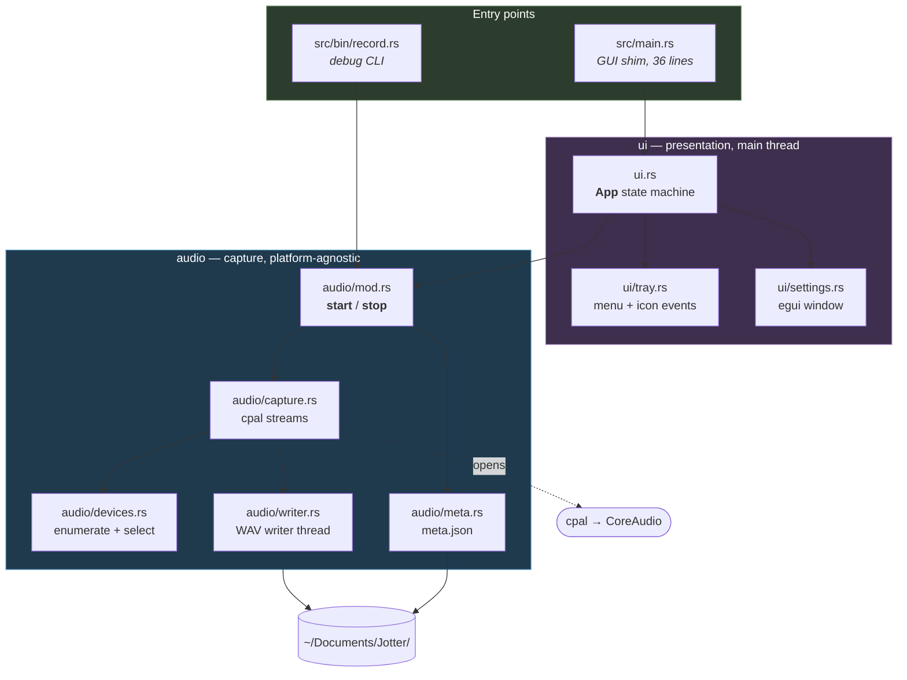
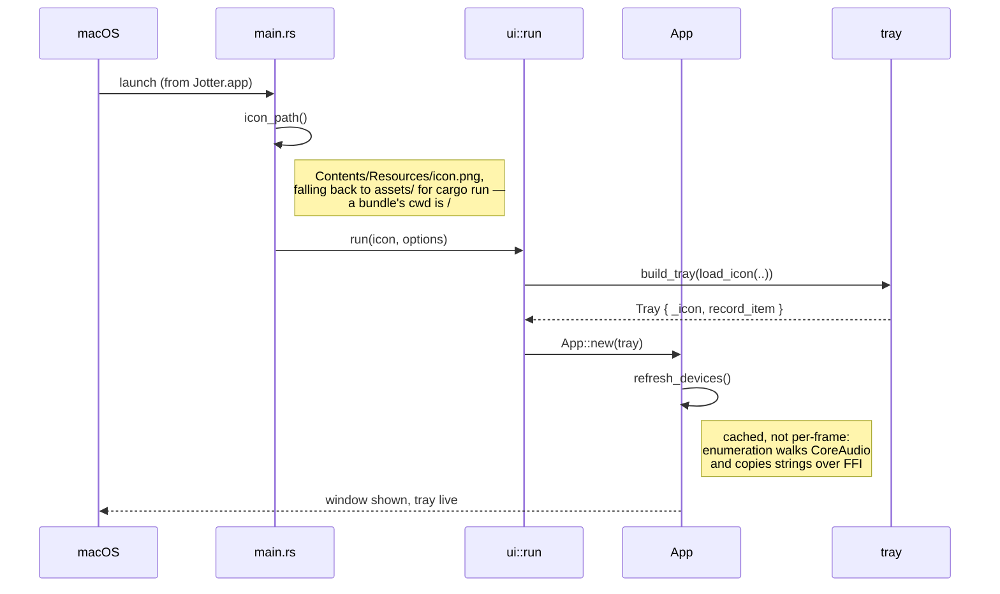

# Jotter architecture

How the app is put together and how audio data moves through it.

For the macOS permission story, the cpal loopback mechanics and the debug
scripts, see [AUDIO_CAPTURE.md](AUDIO_CAPTURE.md).

---

## The shape of it

Everything lives in the library crate. `src/main.rs` (the GUI) and
`src/bin/record.rs` (a debugging CLI) are thin entry points that both drive the
same `audio` API — so anything the CLI proves about capture also holds for the
app.



The one rule worth preserving: **`audio` knows nothing about `ui`.** Dependencies
point one way, which is why the CLI can exercise the whole capture path without
starting a GUI.

---

## Workflow 1 — Startup



---

## Workflow 2 — The event loop

eframe 0.36 splits the loop in two, and the split matters here: **while the
window is hidden, eframe runs no egui pass at all** and calls `logic` instead of
`ui`. Since the window spends most of its life hidden, tray polling has to live
in `logic` — in `ui` the menu would be dead exactly when it is the user's only
interface.

`logic` only runs when a repaint is pending, so it re-arms itself.


---

## Workflow 3 — Starting a recording

Both entry points converge on `audio::start`. The mic and system paths are
deliberately **separate functions** rather than one parameterised helper: they
differ in which config accessor applies and in which failures matter, and
collapsing them is what makes the loopback footgun easy to trip.

```mermaid
sequenceDiagram
    autonumber
    participant U as User
    participant App as ui::App
    participant S as audio::start
    participant C as capture
    participant D as devices
    participant W as TrackWriter
    participant CP as cpal

    U->>App: Start Recording
    App->>App: dir = recordings_root()/<br/>recording_dir_name()
    App->>S: start(RecordConfig)
    S->>S: create_dir_all(out_dir)
    Note right of S: first run prompts for<br/>Documents access (TCC)

    rect rgb(31, 58, 77)
    Note over S,CP: Microphone
    S->>C: open_mic(choice, mic.wav)
    C->>D: resolve_mic()
    Note right of D: prefers BuiltIn over system default —<br/>macOS degrades Bluetooth mics<br/>into call mode
    C->>CP: default_input_config()
    C->>W: TrackWriter::new() → (writer, sink)
    C->>CP: build_input_stream(sink)
    end

    rect rgb(61, 47, 77)
    Note over S,CP: System audio
    S->>C: open_loopback(choice, system.wav)
    C->>D: resolve_system()
    C->>C: supports_input()?
    Note right of C: DUPLEX GUARD — cpal only taps<br/>a device reporting NO input.<br/>Otherwise it records the mic,<br/>silently, into system.wav
    C->>CP: default_output_config()
    Note right of C: not default_input_config():<br/>the device has no input config
    C->>W: TrackWriter::new() → (writer, sink)
    C->>CP: build_input_stream(sink)
    Note right of CP: no explicit loopback API —<br/>input stream on an OUTPUT device.<br/>macOS: CoreAudio process tap<br/>Windows: WASAPI loopback flag<br/>Linux: PipeWire STREAM_CAPTURE_SINK
    end

    S->>CP: stream.play() ×2
    Note right of CP: cpal 0.17 stopped auto-starting.<br/>0.18 is play()/pause(), not start()
    S-->>App: RecordingHandle
    App->>App: status = Recording<br/>tray.set_recording(true)
```



---

## Workflow 4 — The audio hot path

This is the part with real constraints. The cpal callback runs on a **realtime
audio thread**; blocking it on file I/O causes dropouts. So the callback does
only cheap, bounded work and hands ownership across a channel.

```mermaid
flowchart LR
    subgraph rt["Realtime audio thread — never blocks"]
        CB["cpal data callback<br/>samples + InputCallbackInfo"]
        TS["TrackSink::push"]
        T1["record first callback<br/>StreamInstant (once)"]
        T2["downmix to mono<br/><i>average channels</i>"]
        T3["f32 → i16<br/><i>clamp before scaling</i>"]
        CB --> TS --> T1 --> T2 --> T3
    end

    CH{{"mpsc::channel<br/>Vec&lt;i16&gt;"}}
    T3 -->|send, owned buffer| CH

    subgraph wt["Writer thread — may block"]
        RX["for buf in rx"]
        HW["hound::WavWriter<br/>write_sample"]
        FIN["finalize()<br/><i>on channel close</i>"]
        RX --> HW --> FIN
    end

    CH --> RX
    FIN --> WAV[("mic.wav / system.wav")]

    style rt fill:#4d2f2f,stroke:#b87f7f,color:#fff
    style wt fill:#1f3a4d,stroke:#4a90b8,color:#fff
```



Why each step is the way it is:

| Step | Reason |
| --- | --- |
| Channel, not direct write | A realtime thread that blocks on I/O produces dropouts. |
| Clamp before scaling | Loopback audio can exceed ±1.0 when an app applies its own gain; wrapping would turn a loud passage into harsh noise. |
| Downmix to mono | System audio arrives stereo, the mic mono. Transcription wants one channel. |
| **No resampling** | Native 48 kHz is preserved. Whisper wants 16 kHz, but decimating in the callback would alias — resample later with a real resampler. |
| Dropped buffer on send failure | If the writer dies or falls behind, dropping is the only realtime-safe option. The frame count in `meta.json` reflects the loss. |
| First `StreamInstant` recorded once | The two streams have independent clocks; on macOS both instants derive from host time, so their difference aligns the tracks. |

---

## Workflow 5 — Stopping

Ordering matters. Pause before tearing down writers so no callback races the
channel close, and finalize before the process exits.

```mermaid
sequenceDiagram
    autonumber
    participant U as User
    participant App as ui::App
    participant H as RecordingHandle::stop
    participant W as TrackWriter::finish
    participant WT as writer thread
    participant M as meta

    U->>App: Stop / Quit / Cmd-Q
    App->>H: handle.stop()
    H->>H: stream.pause(); drop(stream)
    Note right of H: pause first — a live callback<br/>racing the channel close
    H->>W: finish() per track
    W->>W: drop Sender
    Note right of W: closing the channel is what<br/>ends the writer's `for buf in rx`
    WT->>WT: finalize() → real RIFF length
    Note right of WT: skip this and the header keeps<br/>a placeholder length; many tools<br/>then refuse to open the file
    WT-->>W: frames written
    W-->>H: TrackInfo
    H->>M: Meta { started, ended, mic, system }
    M->>M: write(meta.json)
    H-->>App: Meta
    App->>App: status = Finished
```

**Every exit path finalizes.** Tray Quit calls `stop_recording` before
`exit(0)`; `App::on_exit` catches Cmd-Q and normal shutdown. Without both, a
crash-out mid-meeting leaves an unreadable WAV and you find out at transcription
time.

---

## Recording state machine

```mermaid
stateDiagram-v2
    [*] --> Idle
    Idle --> Recording: toggle_recording()<br/>audio::start ok
    Idle --> Error: start failed<br/>(duplex / permission / io)
    Recording --> Finished: stop() ok
    Recording --> Error: stop() failed
    Error --> Recording: retry
    Finished --> Recording: start again

    note right of Recording
        Device pickers are locked.
        A device cannot change
        underneath a live stream.
    end note

    note right of Finished
        A zero-frame track is flagged
        red — otherwise it is
        indistinguishable from success.
    end note
```

---

## Output

```
~/Documents/Jotter/2026-09-15_14-32-08/
├── mic.wav      you          48 kHz mono i16
├── system.wav   everyone else 48 kHz mono i16
└── meta.json    devices, rates, frames, stream_errors, first-callback instants
```

Two tracks rather than one mixed file, because merging is lossy in ways you
cannot undo: overlapping speech collapses (Whisper drops or garbles a speaker),
diarization has to recover "me" from scratch instead of knowing it for free, and
per-track gain normalization becomes impossible. You can always mix down later;
you can never un-mix.

Downstream this feeds `whisper → action_items.sh`, which is not wired up yet.

---

## Failure modes worth knowing

These are the ones that fail *quietly*, which is why the code checks for them
explicitly rather than trusting the happy path.

| Symptom | Cause | Where it's handled |
| --- | --- | --- |
| `system.wav` is all digital zeros | No system-audio permission. macOS runs the tap and feeds it silence rather than failing. | Flagged by `analyze_wav.py`; requires running from the bundle |
| `system.wav` contains the **microphone** | Loopback opened on a duplex device — cpal's tap branch only triggers when `supports_input()` is false | `open_loopback` refuses duplex outright (`CaptureError::DuplexSystemDevice`) |
| Zero frames captured | Output device was idle — a tap produces no callbacks when nothing is playing | Flagged in the settings pane and CLI output |
| Truncated / unopenable WAV | Process exited without `finalize()` | `on_exit` + tray Quit both stop first |
| Tray menu unresponsive | Polling put in `ui` instead of `logic` | `logic` polls and re-arms its own repaint |
| Writes to `/recordings` | Relative path from a bundle, whose cwd is `/` | `recordings_root()` is absolute |

---

## Module reference

| Module | Owns |
| --- | --- |
| `audio/mod.rs` | `RecordConfig`, `Sources`, `RecordingHandle`; `start` / `stop` orchestration |
| `audio/devices.rs` | Enumeration, direction classification, `can_loopback()`, default selection |
| `audio/capture.rs` | `open_mic` / `open_loopback`, the duplex guard, `CaptureError` and its per-platform access hints |
| `audio/writer.rs` | `TrackWriter` / `TrackSink`, the realtime→writer boundary, format conversion |
| `audio/meta.rs` | `Meta`, `TrackInfo`, `track_offset_secs()` |
| `ui.rs` | `App`, the recording state machine, tray pumping, paths |
| `ui/tray.rs` | `Tray`, `MenuAction`, event draining |
| `ui/settings.rs` | egui window, device pickers, status rendering |
