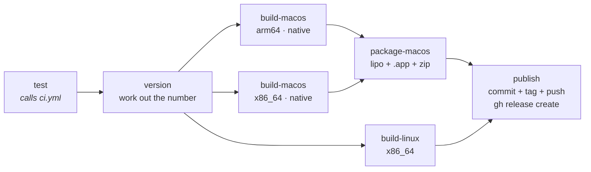

# CI/CD

Two workflows. `ci.yml` gates every push; `release.yml` bumps the version and
publishes binaries when `main` moves.

## CI — `.github/workflows/ci.yml`

Runs on every push to any branch, on pull requests, and — via `workflow_call` —
as the gate inside the release workflow, so "tests pass" means the same thing in
both places.

Matrix: `ubuntu-latest`, `macos-latest` (Apple Silicon) and `macos-15-intel`,
`fail-fast: false` so a break on one platform cannot hide a break on another.
Steps: `fmt --check`, `clippy`, `test`, `build`, and a feature-matrix `check`,
all with `RUSTFLAGS: -D warnings`.

Both macOS architectures are here because the release ships a universal binary
built from a native build of each, and an x86_64-only break must fail on the
pull request rather than during the release. See *Reproducing CI locally* below
for why the cheaper thing that used to stand in for the Intel leg — a
`cargo check --target x86_64-apple-darwin` on the Apple Silicon runner — proved
nothing.

The feature matrix exists because the GUI and the CLI are `cfg`'d halves of one
binary: code that only compiles with both features on builds fine by default and
breaks nobody's machine until someone builds CLI-only. With `-D warnings`, an
import left unused under one feature fails the job.

`telemetry` is in the matrix for a sharper version of the same reason. It ships
two implementations of one type — the real handle and a no-op shim — so that no
call site needs a `cfg`. Nothing but a build without the feature will notice if
their signatures drift, and the only people who build that way are packagers.

### What the tests cover, and why so narrowly

CI runners are headless with no audio devices, so the suite covers **pure logic
only** — sample conversion, downmix, the loopback duplex guard, metadata
arithmetic. Anything calling into cpal device enumeration would be flaky there
and belongs in `scripts/check_audio.sh`, which needs real hardware.

The most valuable one is `only_output_only_devices_can_loopback`. It pins the
invariant that cpal only taps system audio on a device reporting *no* input —
hand it a duplex device and it silently records the microphone into
`system.wav`, with no error, discovered only at transcription time.

### Reproducing CI locally

```sh
cargo fmt --all --check && cargo clippy --all-targets --locked \
  && cargo test --all-targets --locked && cargo build --locked \
  && cargo check --locked --no-default-features --features cli \
  && cargo check --locked --no-default-features --features gui \
  && cargo check --locked --no-default-features --features cli,telemetry \
  && cargo check --locked --no-default-features --features gui,telemetry \
  && cargo check --locked --no-default-features --features gui,cli

scripts/check_linux_build.sh ci   # the Linux half, in a container
```

The Linux half genuinely cannot be checked from macOS with plain cargo — the
`pipewire` and `alsa` `-sys` crates need Linux headers. Note that `ci` runs the
full gate; plain `check` only type-checks and **does not link**, which is how a
missing system library goes unnoticed until a real `cargo build` — `tray-icon`'s
`libxdo` was exactly this, a bare `cargo:rustc-link-lib=xdo` that only fails at
the link step. It is no longer a dependency (see the note in `Cargo.toml`), but
the lesson stands: type-checking a build proves less than it looks.

It cost a release the second time. `ci.yml` used to guard the universal macOS
build with `cargo check --locked --target x86_64-apple-darwin` on the Apple
Silicon runner, on the reasoning that `check` still runs build scripts and so
still compiles the C++. It does — but `aec`'s bundled WebRTC/abseil build is not
target-aware and compiled that C++ for the *host*, and only the link `check`
skips would have noticed. v0.1.7 passed CI, then failed in the release with
every `webrtc::` symbol undefined for x86_64. The guard is gone; a real native
build on each architecture replaces it.

## Release — `.github/workflows/release.yml`

Triggered by a push to `main`:



1. **test** — the full CI matrix. Nothing ships if it fails.
2. **version** — runs `scripts/bump_version.sh patch` and throws the result
   away, keeping only the number and the SHA at the tip of `main`. Nothing is
   committed, tagged or pushed.
3. **build-macos** / **build-linux** — check out that SHA, re-apply the same
   bump to the working tree (so the binary reports the version about to be
   tagged) and build. Nothing is committed here either.
4. **package-macos** — `lipo`s the two native macOS binaries into one universal
   binary, wraps it with `bundle.sh` and zips the `.app`.
5. **publish** — re-applies the bump, commits, tags `vX.Y.Z`, pushes, and
   publishes with `gh release create`.

`concurrency: release` with `cancel-in-progress: false` — two runs would race on
the version number and could claim the same one twice, but a run that has
already pushed a tag must be allowed to finish publishing.

### The tag is cut last, on purpose

Every job before `publish` works on an untagged tree. A version number is only
claimed once binaries exist for every platform, so a failed build costs a re-run
rather than a number.

It used to work the other way — `version` committed, tagged and pushed before
anything was built — and v0.1.7 is what that costs: the macOS build failed, the
release job was skipped, and `main` was left carrying a `v0.1.7` tag and bump
commit for a release that does not exist. The number cannot be reused.

Because the binaries are built from the SHA pinned by `version`, `publish`
pushes with a plain fast-forward (`git push origin HEAD:main --follow-tags`). If
anything else landed on `main` while the builds ran, the push is rejected and
the release fails *before* tagging, rather than pointing a tag at source the
binaries were not built from.

### One runner per macOS architecture

The two macOS halves are built on runners of their own architecture —
`macos-latest` for arm64, `macos-15-intel` for x86_64 — and joined by `lipo` in
a third job.

Cross-building both from the Apple Silicon runner is what broke v0.1.7. The
`aec` feature builds WebRTC's `AudioProcessing` and abseil from C++ source with
meson, and that build compiles for the host no matter what `--target` says. The
x86_64 rlib ended up full of arm64 objects, `ld` discarded every one of them
(`found architecture 'arm64', required architecture 'x86_64'`) and the link
failed on undefined `webrtc::` symbols.

Each build step asserts its output's architecture with `lipo -info` rather than
trusting the runner label, and `package-macos` asserts that the joined binary
really contains both slices. `bundle.sh` takes `VERSION` from the environment
when set, since the packaging job never applies the bump to its own checkout.

Native-per-architecture also happens to be what `transcribe` wants. The
sherpa-onnx build script picks a prebuilt static archive by host target
(`osx-arm64`, `osx-x64`, `linux-x64`), so each leg gets the right one without
being told — but a cross-build would silently fetch the runner's architecture,
the same class of failure as v0.1.7.

### The build now needs network access

`transcribe` links sherpa-onnx statically, and its build script downloads the
matching prebuilt archive from GitHub releases when `SHERPA_ONNX_LIB_DIR` is
unset. That is a *build-time* fetch, not a runtime one: the shipped binary still
has no shared library to find. If a build ever has to run offline, point
`SHERPA_ONNX_LIB_DIR` at a directory of libraries or `SHERPA_ONNX_ARCHIVE_DIR` at
a pre-downloaded archive.

Speech models are **not** fetched by the build and are not in the release
artifacts. They are ~630 MB, shared across recordings, and the user gets them
with `jotter models pull` — see `docs/ARCHITECTURE.md`.

### Versioning

Patch bumps are automatic: every push to `main` that passes tests releases the
next patch. Minor and major are manual — run one, commit it, and the automatic
patch bumps continue from there:

```sh
scripts/bump_version.sh minor     # 0.1.7 -> 0.2.0
scripts/bump_version.sh --current
```

The script edits `Cargo.toml` and keeps `Cargo.lock` in step, then verifies both
agree. That check exists because the obvious implementation is wrong:
`cargo metadata --no-deps` skips resolution and silently leaves the old version
in the lock, which then breaks every `--locked` build downstream.

**No infinite loop**: pushes authenticated with `GITHUB_TOKEN` do not trigger
workflow runs. The `[skip ci]` in the commit message is belt-and-braces.

### Artifacts

| Platform | Artifact | Notes |
| --- | --- | --- |
| macOS | `Jotter-X.Y.Z-macos-universal.zip` | `Jotter.app`, universal via `lipo` |
| Linux | `jotter-X.Y.Z-linux-x86_64.tar.gz` | the `jotter` binary (GUI + CLI) |

**macOS ships the `.app`, not a bare binary** — and this is not cosmetic. macOS
will not grant system-audio access to an executable with no bundle identity; it
feeds the capture digital silence instead of prompting. A released bare binary
would look like it worked and record nothing. `bundle.sh` reports the version CI
is tagging — from `$VERSION` when the workflow sets it, from `Cargo.toml`
otherwise.

A universal binary rather than two downloads, so users never have to work out
which Mac they have.

### Build-time configuration

Both build steps read `JOTTER_POSTHOG_KEY` from a repo **variable**, not a
secret. PostHog project tokens are write-only and public by design — every site
running PostHog serves one in its page source — so there is nothing to protect,
and making it a secret would only break fork PRs, where secrets are unavailable.

It is the one `option_env!` in the codebase. Unset, telemetry compiles in but
stays inert, which is exactly what a fork or a local `cargo build` should get.
Set it in Settings → Secrets and variables → Actions → Variables. See
`docs/TELEMETRY.md`.

Note for future packaging: outbound HTTPS needs no macOS entitlement today
because the bundle is ad-hoc signed with no App Sandbox. Mac App Store
distribution would require `com.apple.security.network.client`.

## Known limitations

- **Not notarized.** The bundle is ad-hoc signed, because there are no signing
  identities on this machine. Gatekeeper will block it on first launch;
  the release notes tell users to right-click → Open or clear the quarantine
  attribute. Proper notarization needs a paid Apple Developer account and
  `APPLE_ID` / `APPLE_TEAM_ID` / app-specific-password secrets.
- **Linux is compile-verified only** — no runtime confirmation against a live
  PipeWire session. The release notes say so.
- **No Windows build.** The loopback idiom is the same and WASAPI loopback is
  well-trodden, but nothing has exercised it.
- **If `main` is a protected branch**, the bot's push will be rejected. Either
  allow `github-actions[bot]` to bypass, or move the bump to a PR.
- **The x86_64 macOS build depends on a hosted Intel image.** `macos-15-intel`
  is the current one; Apple Silicon is where the images are going, and when the
  Intel line is retired the universal build needs another answer — a working
  cross-build of the bundled C++, or dropping to arm64-only.
- The release gate proves the code compiles and the logic tests pass. It cannot
  prove audio capture still works — that needs `scripts/check_audio.sh` on real
  hardware.
