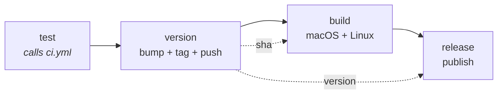

# CI/CD

Two workflows. `ci.yml` gates every push; `release.yml` bumps the version and
publishes binaries when `main` moves.

## CI — `.github/workflows/ci.yml`

Runs on every push to any branch, on pull requests, and — via `workflow_call` —
as the gate inside the release workflow, so "tests pass" means the same thing in
both places.

Matrix: `ubuntu-latest` and `macos-latest`, `fail-fast: false` so a Linux-only
break cannot hide a macOS-only one. Steps: `fmt --check`, `clippy`, `test`,
`build`, all with `RUSTFLAGS: -D warnings`.

### What the tests cover, and why so narrowly

CI runners are headless with no audio devices, so the suite covers **pure logic
only** — sample conversion, downmix, the loopback duplex guard, metadata
arithmetic. Anything calling into cpal device enumeration would be flaky there
and belongs in `scripts/check_audio.sh`, which needs real hardware.

The most valuable one is `only_output_only_devices_can_loopback`. It pins the
invariant that cpal only taps system audio on a device reporting *no* input —
hand it a duplex device and it silently records the microphone into
`system.wav`, with no error, discovered only at transcription time.

### Reproducing CI locally

```sh
cargo fmt --all --check && cargo clippy --all-targets --locked \
  && cargo test --all-targets --locked && cargo build --locked

scripts/check_linux_build.sh ci   # the Linux half, in a container
```

The Linux half genuinely cannot be checked from macOS with plain cargo — the
`pipewire` and `alsa` `-sys` crates need Linux headers. Note that `ci` runs the
full gate; plain `check` only type-checks and **does not link**, which is how a
missing `libxdo-dev` went unnoticed until a real `cargo build`.

## Release — `.github/workflows/release.yml`

Triggered by a push to `main`. Four jobs, in order:



1. **test** — the full CI matrix. Nothing ships if it fails.
2. **version** — `scripts/bump_version.sh patch`, commit, tag `vX.Y.Z`, push.
3. **build** — checks out *the bumped commit* so binaries report the tagged
   version, then builds per platform.
4. **release** — downloads artifacts, renames them with the version, and
   publishes with `gh release create`.

`concurrency: release` with `cancel-in-progress: false` — two runs would race on
the bump and could tag the same number twice, but a run that has already pushed
a tag must be allowed to finish publishing.

### Versioning

Patch bumps are automatic: every push to `main` that passes tests releases the
next patch. Minor and major are manual — run one, commit it, and the automatic
patch bumps continue from there:

```sh
scripts/bump_version.sh minor     # 0.1.7 -> 0.2.0
scripts/bump_version.sh --current
```

The script edits `Cargo.toml` and keeps `Cargo.lock` in step, then verifies both
agree. That check exists because the obvious implementation is wrong:
`cargo metadata --no-deps` skips resolution and silently leaves the old version
in the lock, which then breaks every `--locked` build downstream.

**No infinite loop**: pushes authenticated with `GITHUB_TOKEN` do not trigger
workflow runs. The `[skip ci]` in the commit message is belt-and-braces.

### Artifacts

| Platform | Artifact | Notes |
| --- | --- | --- |
| macOS | `Jotter-X.Y.Z-macos-universal.zip` | `Jotter.app`, universal via `lipo` |
| Linux | `jotter-X.Y.Z-linux-x86_64.tar.gz` | `jotter` + `record` binaries |

**macOS ships the `.app`, not a bare binary** — and this is not cosmetic. macOS
will not grant system-audio access to an executable with no bundle identity; it
feeds the capture digital silence instead of prompting. A released bare binary
would look like it worked and record nothing. `bundle.sh` reads the version from
`Cargo.toml`, so released bundles report what CI tagged.

A universal binary rather than two downloads, so users never have to work out
which Mac they have.

## Known limitations

- **Not notarized.** The bundle is ad-hoc signed, because there are no signing
  identities on this machine. Gatekeeper will block it on first launch;
  the release notes tell users to right-click → Open or clear the quarantine
  attribute. Proper notarization needs a paid Apple Developer account and
  `APPLE_ID` / `APPLE_TEAM_ID` / app-specific-password secrets.
- **Linux is compile-verified only** — no runtime confirmation against a live
  PipeWire session. The release notes say so.
- **No Windows build.** The loopback idiom is the same and WASAPI loopback is
  well-trodden, but nothing has exercised it.
- **If `main` is a protected branch**, the bot's push will be rejected. Either
  allow `github-actions[bot]` to bypass, or move the bump to a PR.
- The release gate proves the code compiles and the logic tests pass. It cannot
  prove audio capture still works — that needs `scripts/check_audio.sh` on real
  hardware.
