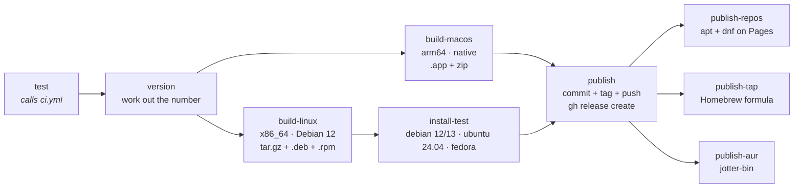

# CI/CD

Two workflows. `ci.yml` gates every push; `release.yml` bumps the version and
publishes binaries when `main` moves.

## CI — `.github/workflows/ci.yml`

Runs on every push to any branch, on pull requests, and — via `workflow_call` —
as the gate inside the release workflow, so "tests pass" means the same thing in
both places.

Matrix: `ubuntu-latest` and `macos-latest` (Apple Silicon), `fail-fast: false`
so a break on one platform cannot hide a break on another. Steps:
`fmt --check`, `clippy`, `test`, `build` across the whole workspace, a build of
the benchmark harness (Ubuntu only), and a feature-matrix `check`, all with
`RUSTFLAGS: -D warnings`.
Cargo cache saves only on `main` and `trunk/cli-agent` (a pull request restores the base ref and does not save); `test` runs before `clippy`, the redundant workspace `build` and default-features `cargo check -p jotter` are omitted, and sccache (local disk) covers the WebRTC C++ rebuild.

There is no Intel macOS leg. Jotter supports Apple Silicon only — Intel Macs
were dropped deliberately — so the one macOS runner is the architecture the
release builds and ships.

Two steps exist because of `Swatinem/rust-cache` rather than the code.
*Reset the sherpa-onnx prebuilt cache* runs right after the restore:
sherpa-onnx-sys unpacks its static libraries into `target/sherpa-onnx-prebuilt`,
which is not a Cargo profile directory, so the cache's pruning empties it while
keeping the build script's output that points there — and a later full build
fails with `could not find native static library sherpa-onnx-c-api`. And
`liblzma-dev` is installed on Linux because `lzma-sys`, under that same build
script, links the system liblzma when pkg-config finds one and keeps that choice
in the cache, so a runner without the package cannot link a restored build.

The feature matrix exists because the optional stages are `cfg`'d out of one
codebase, and code that only compiles with every feature on builds fine by
default and breaks nobody's machine until someone builds without one. With
`-D warnings`, an import left unused under one feature set fails the job. Each
leg is there for a reason of its own:

| Leg | Why |
| --- | --- |
| `-p jotter` | The library with its default features (`aec`, `transcribe`, `diarize`) — exactly what a host app gets from a plain git dependency. The workspace build never sees this set on its own, because the CLI adds `telemetry` |
| `-p jotter --no-default-features` | The bare library: capture only. No C++ WebRTC build, no ONNX runtime, no network — the floor every other feature set stands on, and the proof that turning `aec` off keeps needing no C++ toolchain |
| `-p jotter --no-default-features --features telemetry` | The telemetry shim question below, asked of the library with no stage compiled in |
| `-p jotter-cli --no-default-features` | The CLI, capture only. Every call it makes into a stage has to be gated for this to compile, so it is where a missing `cfg` in the CLI shows up |
| `-p jotter-cli --no-default-features --features telemetry` | The same, with the real telemetry handle in place of the shim |
| `-p jotter-cli --no-default-features --features aec` | Echo cancellation without transcription. `jotter record` chains the stages through `audio::finish`, and this is the build where only the first of them exists |
| `-p jotter-cli --no-default-features --features bench` | The benchmark driver on its own. `bench` implies `transcribe` and nothing else, so this is the build that proves `jotter-bench` does not lean on `aec` or `telemetry` by accident |

`telemetry` is in the matrix for a sharper version of the same reason. It ships
two implementations of one type — the real handle and a no-op shim — so that no
call site needs a `cfg`. Nothing but a build without the feature will notice if
their signatures drift, and the only people who build that way are packagers
and host apps — which, since the library leaves it off by default, is every
host app.

### What the tests cover, and why so narrowly

CI runners are headless with no audio devices, so the suite covers **pure logic
only** — sample conversion, downmix, the loopback duplex guard, metadata
arithmetic. Anything calling into cpal device enumeration would be flaky there
and belongs in `scripts/check_audio.sh`, which needs real hardware.

The most valuable one is `only_output_only_devices_can_loopback`. It pins the
invariant that cpal only taps system audio on a device reporting *no* input —
hand it a duplex device and it silently records the microphone into
`system.wav`, with no error, discovered only at transcription time.

### Reproducing CI locally

```sh
cargo fmt --all --check \
  && cargo clippy --workspace --all-targets --locked \
  && cargo test --workspace --all-targets --locked \
  && cargo build --workspace --locked \
  && cargo build --locked -p jotter-cli --features bench \
  && cargo check --locked -p jotter \
  && cargo check --locked -p jotter --no-default-features \
  && cargo check --locked -p jotter --no-default-features --features telemetry \
  && cargo check --locked -p jotter-cli --no-default-features \
  && cargo check --locked -p jotter-cli --no-default-features --features telemetry \
  && cargo check --locked -p jotter-cli --no-default-features --features aec \
  && cargo check --locked -p jotter-cli --no-default-features --features bench

scripts/check_linux_build.sh ci   # the Linux half, in a container
```

The Linux half genuinely cannot be checked from macOS with plain cargo — the
`pipewire` and `alsa` `-sys` crates need Linux headers. Note that `ci` runs the
full gate; plain `check` only type-checks and **does not link**, which is how a
missing system library goes unnoticed until a real `cargo build`: a `-sys` crate
that emits a bare `cargo:rustc-link-lib` type-checks everywhere and fails only
at the link step. Type-checking a build proves less than it looks.

That lesson has already cost a release. `ci.yml` used to guard the universal macOS
build with `cargo check --locked --target x86_64-apple-darwin` on the Apple
Silicon runner, on the reasoning that `check` still runs build scripts and so
still compiles the C++. It does — but `aec`'s bundled WebRTC/abseil build is not
target-aware and compiled that C++ for the *host*, and only the link `check`
skips would have noticed. v0.1.7 passed CI, then failed in the release with
every `webrtc::` symbol undefined for x86_64. The guard is gone, and so is the
Intel build it guarded: macOS releases are Apple Silicon only, built natively.

## Release — `.github/workflows/release.yml`

Triggered by a push to `main`:



1. **test** — the full CI matrix. Nothing ships if it fails.
2. **version** — runs `scripts/bump_version.sh patch` and throws the result
   away, keeping only the number and the SHA at the tip of `main`. Nothing is
   committed, tagged or pushed.
3. **build-macos** / **build-linux** — check out that SHA, re-apply the same
   bump to the working tree (so the binary reports the version about to be
   tagged) and build only the shipped binary, with
   `cargo build --release --locked -p jotter-cli --bin jotter`. The macOS job
   then asserts the binary is arm64, wraps it with `bundle.sh` and zips the
   `.app`. The Linux job runs in a Debian 12 container and packages the binary
   with `scripts/package_linux.sh`. Nothing is committed here either.
4. **install-test** — installs the `.deb` or `.rpm` on each supported
   distribution and runs it (see below).
5. **publish** — re-applies the bump, commits, tags `vX.Y.Z`, pushes, and
   publishes with `gh release create`.
6. **publish-repos** / **publish-tap** / **publish-aur** — put the release
   into the package managers. See *Distribution* below.

`concurrency: release` with `cancel-in-progress: false` — two runs would race on
the version number and could claim the same one twice, but a run that has
already pushed a tag must be allowed to finish publishing.

### The tag is cut last, on purpose

Every job before `publish` works on an untagged tree. A version number is only
claimed once binaries exist for every platform, so a failed build costs a re-run
rather than a number.

It used to work the other way — `version` committed, tagged and pushed before
anything was built — and v0.1.7 is what that costs: the macOS build failed, the
release job was skipped, and `main` was left carrying a `v0.1.7` tag and bump
commit for a release that does not exist. The number cannot be reused.

Because the binaries are built from the SHA pinned by `version`, `publish`
pushes with a plain fast-forward (`git push origin HEAD:main --follow-tags`). If
anything else landed on `main` while the builds ran, the push is rejected and
the release fails *before* tagging, rather than pointing a tag at source the
binaries were not built from.

### macOS: Apple Silicon only, built natively

The macOS build runs on `macos-latest`, an Apple Silicon runner, and produces
an arm64 binary and nothing else. Intel Macs are not supported: that was a
deliberate choice, not an omission, and there is no universal binary.

Native rather than cross-built for a reason that predates the decision.
Cross-building x86_64 from the Apple Silicon runner is what broke v0.1.7: the
`aec` feature builds WebRTC's `AudioProcessing` and abseil from C++ source with
meson, and that build compiles for the host no matter what `--target` says. The
x86_64 rlib ended up full of arm64 objects, `ld` discarded every one of them
(`found architecture 'arm64', required architecture 'x86_64'`) and the link
failed on undefined `webrtc::` symbols. The sherpa-onnx build script has the
same property — it picks its prebuilt archive (`osx-arm64`, `linux-x64`) by
host — so a native build is the only kind that is right without being told.

The build step still asserts `arm64` with `lipo -info` rather than trusting the
runner label, so a relabelled image cannot ship an Intel binary under an arm64
name.

### The build now needs network access

`transcribe` links sherpa-onnx statically, and its build script downloads the
matching prebuilt archive from GitHub releases when `SHERPA_ONNX_LIB_DIR` is
unset. That is a *build-time* fetch, not a runtime one: the shipped binary still
has no shared library to find. If a build ever has to run offline, point
`SHERPA_ONNX_LIB_DIR` at a directory of libraries or `SHERPA_ONNX_ARCHIVE_DIR` at
a pre-downloaded archive.

Speech models are **not** fetched by the build and are not in the release
artifacts. They are ~630 MB, shared across recordings, and the user gets them
with `jotter models pull` — see `docs/ARCHITECTURE.md`.

### Versioning

Patch bumps are automatic: every push to `main` that passes tests releases the
next patch. Minor and major are manual — run one, commit it, and the automatic
patch bumps continue from there:

```sh
scripts/bump_version.sh minor     # 0.1.7 -> 0.2.0
scripts/bump_version.sh --current
```

The script rewrites `version` in the root `Cargo.toml`'s `[workspace.package]`
— both crates inherit it, so there is one number to move — and keeps
`Cargo.lock` in step, then verifies both
agree. That check exists because the obvious implementation is wrong:
`cargo metadata --no-deps` skips resolution and silently leaves the old version
in the lock, which then breaks every `--locked` build downstream.

**No infinite loop**: pushes authenticated with `GITHUB_TOKEN` do not trigger
workflow runs. The `[skip ci]` in the commit message is belt-and-braces.

### Artifacts

| Platform | Artifact | Notes |
| --- | --- | --- |
| macOS | `Jotter-X.Y.Z-macos-arm64.zip` | `Jotter.app`, Apple Silicon only |
| Linux | `jotter-X.Y.Z-linux-x86_64.tar.gz` | the `jotter` binary, `LICENSE`, and `docs/AUDIO_CAPTURE.md` as `README.md` |
| Linux | `jotter_X.Y.Z-1_amd64.deb` | Debian 12+, Ubuntu 24.04+ |
| Linux | `jotter-X.Y.Z-1.x86_64.rpm` | Fedora, openSUSE |

All three Linux artifacts carry the same binary. None of them strip it:
telemetry's crash reports are symbolicated from its symbols.

**macOS ships the `.app`, not a bare binary** — and this is not cosmetic. macOS
will not grant system-audio access to an executable with no bundle identity; it
feeds the capture digital silence instead of prompting. A released bare binary
would look like it worked and record nothing. `bundle.sh` reports the version CI
is tagging — the release job applies the bump to its own checkout before
packaging, and an explicit `$VERSION` wins when set.

The release notes describe a command-line tool. On macOS that means running
`jotter` through the bundle — `open -a Jotter.app --args record …` — so the
capture is attributed to it; the bundle has no window and no Dock icon. On
Linux the binary needs only `libpipewire-0.3` and `libasound2` at runtime.

### Build-time configuration

Both build steps read `JOTTER_POSTHOG_KEY` from a repo **variable**, not a
secret. PostHog project tokens are write-only and public by design — every site
running PostHog serves one in its page source — so there is nothing to protect,
and making it a secret would only break fork PRs, where secrets are unavailable.

It is the one `option_env!` in the codebase. Unset, telemetry compiles in but
stays inert, which is exactly what a fork or a local `cargo build` should get.
Set it in Settings → Secrets and variables → Actions → Variables. See
`docs/TELEMETRY.md`.

Note for future packaging: outbound HTTPS needs no macOS entitlement today
because the bundle is ad-hoc signed with no App Sandbox. Mac App Store
distribution would require `com.apple.security.network.client`.

## Distribution

| Channel | Install | Source in this repo | Published by | Status |
| --- | --- | --- | --- | --- |
| apt | `apt install jotter`, after adding the repository | `[package.metadata.deb]` in `crates/jotter-cli/Cargo.toml` | `publish-repos` → GitHub Pages | live |
| dnf | `dnf install jotter`, after adding the repository | `[package.metadata.generate-rpm]`, same file | `publish-repos` → GitHub Pages | live |
| Homebrew (macOS) | `brew install nfishel48/tap/jotter` | `packaging/homebrew/jotter.rb` | `publish-tap` → `nfishel48/homebrew-tap` | setup pending, #23 |
| AUR | `yay -S jotter-bin` | `packaging/aur/PKGBUILD` | `publish-aur` → `aur.archlinux.org/jotter-bin` | setup pending, #24 |

These jobs run after `publish`, so the GitHub release already exists when they
start. If one fails, the release is still out and the other channels are not
affected; fix the cause and re-run the failed job.

`publish-tap` and `publish-aur` are skipped unless the repository variable
`PUBLISH_HOMEBREW` or `PUBLISH_AUR` is `true`. Setting the variable is the last
step of setting up that channel, so no release fails for a channel that does
not exist yet. The README and release notes list a channel only once it is live.

### Why Linux builds on Debian 12

A binary needs at least the glibc it was linked against. Built on
`ubuntu-latest` (24.04, glibc 2.39) it would not start on Debian 12 (2.36), the
oldest release Jotter supports. So `build-linux` runs in `rust:1-bookworm`,
with dependencies from `scripts/linux_release_deps.sh`. Meson comes from PyPI
there, because bookworm's meson 1.0 cannot build the bundled WebRTC. The
binary's symbols require GLIBC_2.34 and GLIBCXX_3.4.30 (GCC 12), and the `.deb`
declares exactly that.

The `.deb` names its libraries by hand rather than with cargo-deb's `$auto`.
Debian 13 and Ubuntu 24.04 renamed both of them in the 64-bit time_t transition
(`libasound2t64`, `libpipewire-0.3-0t64`), so each dependency accepts either
name. The `.rpm` needs no such care: its `Requires` are sonames, which each RPM
distribution maps to its own package names.

**install-test** is what enforces this. It installs the package on Debian 12,
Debian 13, Ubuntu 24.04 and Fedora, fails if `ldd` reports a library as
`not found`, and checks `jotter --version`. It cannot test capture, because
containers have no PipeWire session.

Reproduce the job locally, packages and all, with
`scripts/check_linux_build.sh package`. The output goes to `dist/`, built for
the host architecture (arm64 on Apple Silicon).

### The apt and dnf repositories

`scripts/build_package_repo.sh` builds both repositories from the last three
releases' packages. They are served at `https://nfishel48.github.io/Jotter/`,
deployed as a Pages artifact rather than committed to a branch. The site is
rebuilt from scratch on every release, so it holds three versions and git
history never grows. The apt `InRelease`, the dnf `repomd.xml` and each `.rpm`
are signed with one GPG key. Its public half is published as `jotter.asc`, and
`jotter.sources` and `jotter.repo` point apt and dnf at it.

### Homebrew: a formula, not a cask

Homebrew quarantines cask downloads. Because `Jotter.app` is ad-hoc signed and
not notarized, Gatekeeper would refuse it, and Homebrew no longer offers a way
around that. A formula's download is not quarantined. The formula installs
`Jotter.app` into its keg and links `jotter` to the binary inside it, and
`jotter` resolves that symlink to find the bundle. `publish-tap` installs and
tests the rendered formula on a macOS runner before pushing it.

Once releases are signed with a Developer ID and notarized, switch to a cask
that installs to `/Applications`. That also keeps the TCC grant across
upgrades, which an ad-hoc signature does not.

### One-time setup

| What | Where |
| --- | --- |
| Pages source: **GitHub Actions** | Settings → Pages |
| `REPO_GPG_PRIVATE_KEY` secret: an armored private key with no passphrase | Settings → Secrets → Actions |

Homebrew, once its setup is done (#23):

| What | Where |
| --- | --- |
| `nfishel48/homebrew-tap` repository, initialised with a README | GitHub |
| `HOMEBREW_TAP_TOKEN` secret: fine-grained token, *Contents: read and write* on the tap only | Settings → Secrets → Actions |
| `PUBLISH_HOMEBREW` variable: `true` | Settings → Variables → Actions |

The AUR, once its setup is done (#24):

| What | Where |
| --- | --- |
| An AUR account with an SSH key | aur.archlinux.org → My Account |
| `AUR_SSH_PRIVATE_KEY` secret: the private half of that key | Settings → Secrets → Actions |
| `PUBLISH_AUR` variable: `true` | Settings → Variables → Actions |

To generate the signing key:

```sh
export GNUPGHOME="$(mktemp -d)"
gpg --batch --passphrase '' --quick-gen-key "Jotter packages <nfishel@proton.me>" ed25519 sign never
gpg --armor --export-secret-keys | gh secret set REPO_GPG_PRIVATE_KEY
```

Keep a copy of the key somewhere safe. If it is replaced, every user has to
download `jotter.asc` again.

## Known limitations

- **Not notarized.** The bundle is ad-hoc signed, because there are no signing
  identities on this machine. A downloaded zip is blocked on first launch, and
  the release notes tell users to clear the quarantine attribute (the Homebrew
  formula avoids this; see *Distribution*). Every upgrade asks for audio
  permissions again. Proper notarization needs a paid Apple Developer account
  and `APPLE_ID` / `APPLE_TEAM_ID` / app-specific-password secrets.
- **Linux is compile-verified only** — no runtime confirmation against a live
  PipeWire session. The release notes say so.
- **No Windows build.** The loopback idiom is the same and WASAPI loopback is
  well-trodden, but nothing has exercised it.
- **If `main` is a protected branch**, the bot's push will be rejected. Either
  allow `github-actions[bot]` to bypass, or move the bump to a PR.
- **No Intel Mac build**, by decision. Supporting it again would need either a
  hosted Intel runner or a cross-build of the bundled C++ that actually targets
  x86_64 — see the v0.1.7 note above.
- The release gate proves the code compiles and the logic tests pass. It cannot
  prove audio capture still works — that needs `scripts/check_audio.sh` on real
  hardware.
